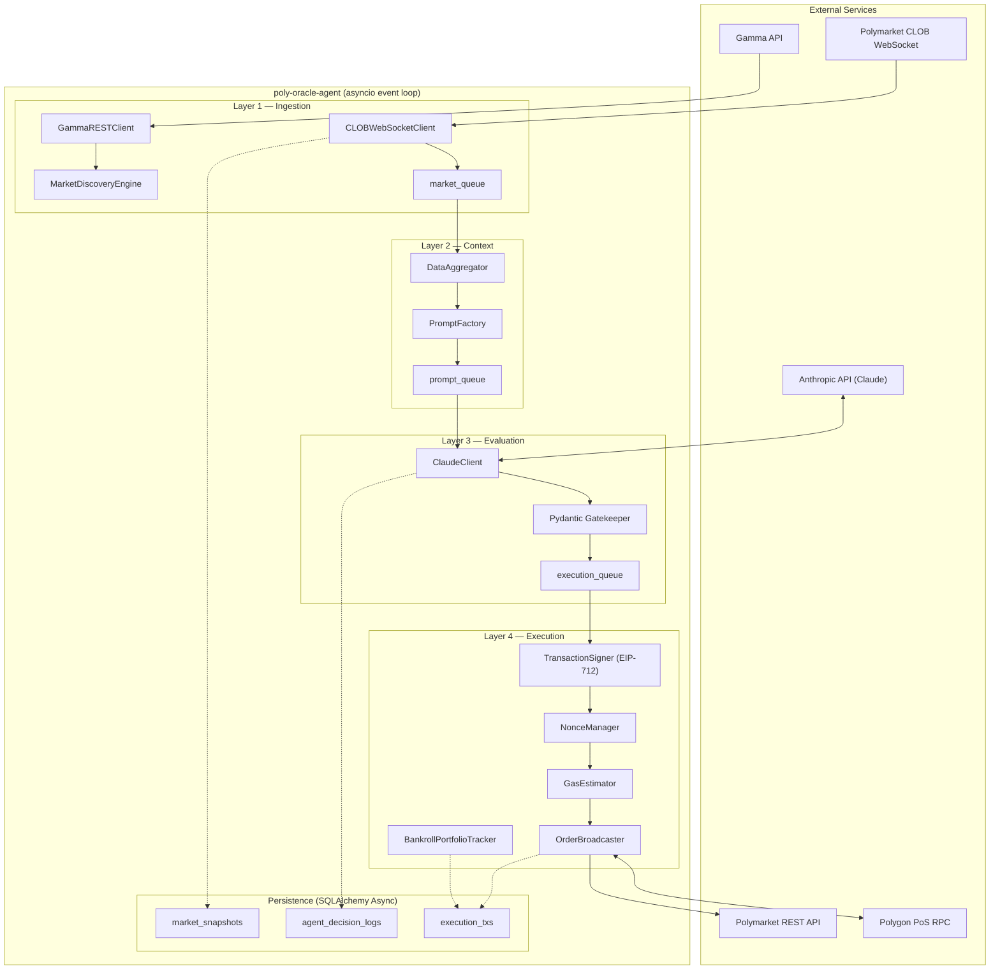

# poly-oracle-agent

## 1. Project Overview

`poly-oracle-agent` is an autonomous AI-powered trading agent for [Polymarket](https://polymarket.com). The system streams live orderbook data via WebSocket, aggregates market context, evaluates trading opportunities using Claude (Anthropic LLM) with structured Chain-of-Thought reasoning, and executes EIP-712 signed orders on the Polymarket CLOB with on-chain settlement on Polygon PoS.

The agent operates as a fully async (`asyncio`) pipeline with four isolated processing layers connected by `asyncio.Queue` bridges.

Current project state:
- **Version:** 0.6.0
- **Status:** Phase 5 Complete (Market Data Integration & Execution Routing)
- **Tests:** 230 automated tests passing
- **Coverage:** 92% (target: ≥ 80%)

Core stack:
- Python 3.12+
- `asyncio` concurrency (all I/O is non-blocking)
- Pydantic V2 + `pydantic-settings`
- SQLAlchemy 2.0 Async + `aiosqlite`
- `httpx` async HTTP client
- `websockets` for CLOB stream ingestion
- `anthropic` for Claude evaluation
- `web3.py` for Polygon PoS / EIP-712 signing
- `structlog` for structured logging
- Alembic for schema migrations

---

## 2. Prerequisites

- **Python 3.12+** (project metadata allows 3.11+, but 3.12+ is the engineering standard)
- **Git**
- Network access to Polymarket CLOB WebSocket, Gamma API, Polygon RPC, and Anthropic API

### Required Secrets

These must be set in `.env` — the system will not start without them:

| Variable | Description |
|---|---|
| `ANTHROPIC_API_KEY` | Anthropic API key for Claude evaluations |
| `POLYGON_RPC_URL` | Polygon PoS JSON-RPC endpoint |
| `WALLET_ADDRESS` | Checksummed EIP-55 Ethereum address (validated at startup) |
| `WALLET_PRIVATE_KEY` | Hex-encoded private key for EIP-712 order signing |

All other variables have defaults and are documented in [Section 5: Configuration](#5-configuration).

Quick start:

```bash
cp .env.example .env
# Edit .env and fill in the 4 required secrets above
# Keep DRY_RUN=true for local development, CI, and validation runs
```

---

## 3. Installation

From repository root:

```bash
python3 -m venv venv
source venv/bin/activate
python -m pip install --upgrade pip
pip install -e .
```

The editable install (`-e .`) is recommended for development. For a non-editable install:

```bash
pip install .
```

---

## 4. Database Setup

Alembic is the **only** supported schema management path. Do not use `Base.metadata.create_all()` in runtime or deployment paths.

```bash
alembic upgrade head
```

This applies all migrations from `migrations/versions/` (baseline: `0001_initial_schema.py`) and creates the three core tables:
- `market_snapshots` — point-in-time orderbook captures (accessed via `MarketRepository`)
- `agent_decision_logs` — full LLM evaluation audit trail (accessed via `DecisionRepository`)
- `execution_txs` — on-chain transaction records (accessed via `ExecutionRepository`)

All runtime persistence is routed through repository classes in `src/db/repositories/`. No agent code accesses the database directly.

Default database: `sqlite+aiosqlite:///./poly_oracle.db` (override via `DATABASE_URL` in `.env`).

---

## 5. Configuration

Configuration is loaded by `AppConfig` (`src/core/config.py`) from environment variables and `.env`. Copy `.env.example` as your starting template.

### Environment Variable Reference

#### Anthropic

| Variable | Type | Default | Required | Description |
|---|---|---|---|---|
| `ANTHROPIC_API_KEY` | SecretStr | — | Yes | API key for Claude |
| `ANTHROPIC_MODEL` | str | `claude-3-5-sonnet-20241022` | No | Model ID |
| `ANTHROPIC_MAX_TOKENS` | int | `4096` | No | Max response tokens |
| `ANTHROPIC_MAX_RETRIES` | int | `2` | No | Retries on JSON validation failure |

#### Polygon / Web3

| Variable | Type | Default | Required | Description |
|---|---|---|---|---|
| `POLYGON_RPC_URL` | str | — | Yes | Polygon PoS JSON-RPC URL |
| `WALLET_ADDRESS` | str | — | Yes | Checksummed EIP-55 address |
| `WALLET_PRIVATE_KEY` | SecretStr | — | Yes | Hex private key for signing |

#### Polymarket CLOB

| Variable | Type | Default | Required | Description |
|---|---|---|---|---|
| `CLOB_REST_URL` | str | `https://clob.polymarket.com` | No | CLOB REST API base URL |
| `CLOB_WS_URL` | str | `wss://ws-subscriptions-clob.polymarket.com/ws/market` | No | CLOB WebSocket URL |
| `GAMMA_API_URL` | str | `https://gamma-api.polymarket.com` | No | Gamma market metadata API |

#### Risk Parameters

| Variable | Type | Default | Required | Description |
|---|---|---|---|---|
| `KELLY_FRACTION` | float | `0.25` | No | Quarter-Kelly multiplier |
| `MIN_CONFIDENCE` | float | `0.75` | No | Minimum LLM confidence score (75%) |
| `MAX_SPREAD_PCT` | float | `0.015` | No | Maximum orderbook spread (1.5%) |
| `MAX_EXPOSURE_PCT` | float | `0.03` | No | Maximum single-trade exposure (3% of bankroll) |
| `MIN_EV_THRESHOLD` | float | `0.02` | No | Minimum expected value edge (2%) |
| `MIN_TTR_HOURS` | float | `4.0` | No | Minimum hours to market resolution |

#### Bankroll

| Variable | Type | Default | Required | Description |
|---|---|---|---|---|
| `INITIAL_BANKROLL_USDC` | Decimal | `1000` | No | Mock bankroll used when `DRY_RUN=true`; live sizing reads Polygon USDC balance on each evaluation |

#### Execution Router

| Variable | Type | Default | Required | Description |
|---|---|---|---|---|
| `MAX_ORDER_USDC` | Decimal | `50` | No | Hard cap on any single WI-16 routed order in USDC |
| `MAX_SLIPPAGE_TOLERANCE` | Decimal | `0.02` | No | Maximum allowed `best_ask` deviation above midpoint before routing fails closed |

#### Gas

| Variable | Type | Default | Required | Description |
|---|---|---|---|---|
| `MAX_GAS_PRICE_GWEI` | float | `500.0` | No | Hard ceiling — raises error above this |
| `FALLBACK_GAS_PRICE_GWEI` | float | `50.0` | No | Fixed price when RPC is unreachable |

#### Database

| Variable | Type | Default | Required | Description |
|---|---|---|---|---|
| `DATABASE_URL` | str | `sqlite+aiosqlite:///./poly_oracle.db` | No | SQLAlchemy async connection string |

#### Operational

| Variable | Type | Default | Required | Description |
|---|---|---|---|---|
| `LOG_LEVEL` | str | `INFO` | No | Allowed: `DEBUG`, `INFO`, `WARNING`, `ERROR` |
| `DRY_RUN` | bool | `false` (AppConfig fallback) | No | **Required value: `true` for local development, CI, and validation runs; only set `false` for controlled post-Phase-3 live operations** |

> **Important:** `DRY_RUN=true` is the required default for local development, CI, and all validation runs. See [Section 11: Operational Notes](#11-operational-notes) for details.

---

## 6. Running the Agent

After environment setup and migration:

```bash
python -m src.orchestrator
```

### Startup Sequence

1. Loads and validates `AppConfig` from `.env`
2. Initializes async database engine and session factory
3. Runs market discovery via `GammaRESTClient` + `MarketDiscoveryEngine`
4. Selects the best eligible market (exits if none found)
5. Wires the four-layer queue pipeline and launches 5 concurrent tasks:
   - **IngestionTask** — `CLOBWebSocketClient` streams market events
   - **ContextTask** — `DataAggregator` maintains state + `PromptFactory` builds prompts
   - **EvaluationTask** — `ClaudeClient` evaluates and routes decisions
   - **ExecutionTask** — Signs and broadcasts approved orders (blocked in dry_run)
   - **DiscoveryTask** — Re-runs market discovery every 5 minutes

Graceful shutdown on `Ctrl+C`: stops components, cancels tasks, closes HTTP clients, disposes database engine.

---

## 7. Running Tests

Run full suite:

```bash
python -m pytest --asyncio-mode=auto tests/
```

Run with coverage:

```bash
python -m coverage run -m pytest tests/ --asyncio-mode=auto
python -m coverage report -m
```

Run focused tests:

```bash
python -m pytest tests/unit/test_schemas.py -v
python -m pytest tests/unit/test_nonce_manager.py -v
```

Current baseline:
- 230 tests
- 92% coverage (target: ≥ 80%)

New code must not decrease coverage below 80%.

---

## 8. Git Workflow

Branching and PR flow:
1. Branch from `develop`.
2. Make one logical (atomic) change per commit.
3. Open PR from `develop` to `main`.
4. Merge only after tests pass and review is complete.

Commit message format:
- `feat(scope): description`
- `fix(scope): description`
- `perf(scope): description`
- `docs(scope): description`
- `chore(scope): description`

Guardrails:
- Never commit `.env`, `venv/`, `*.pyc`, or `__pycache__/`
- No WIP-style commits on shared branches
- Never commit directly to `main`

---

## 9. Architecture Overview

The runtime is a four-layer async pipeline running inside a single `asyncio` event loop. Layers communicate exclusively via `asyncio.Queue` instances.

```
Layer 1: Ingestion → Layer 2: Context → Layer 3: Evaluation → Layer 4: Execution
     ↓ market_queue      ↓ prompt_queue       ↓ execution_queue
  (MarketSnapshot)    (Prompt + State)      (SignedDecision)
```



### Layer Details

| Layer | Components | Responsibility |
|---|---|---|
| **1. Ingestion** | `CLOBWebSocketClient`, `GammaRESTClient`, `MarketDiscoveryEngine` | Stream and validate market events; discover eligible markets; persist snapshots via injectable `MarketRepository` factory |
| **2. Context** | `DataAggregator`, `PromptFactory` | Maintain orderbook state; emit on time/volatility triggers; build structured CoT prompts |
| **3. Evaluation** | `ClaudeClient` + Pydantic Gatekeeper (`LLMEvaluationResponse`) | Query Claude; validate and enforce 5 safety filters; persist decisions via injectable `DecisionRepository` factory; route approved trades |
| **4. Execution** | `ExecutionRouter`, `BankrollSyncProvider`, `TransactionSigner`, `NonceManager`, `GasEstimator`, `OrderBroadcaster`, `BankrollPortfolioTracker` | Read live Polygon USDC bankroll, route validated BUY decisions into capped/slippage-checked order payloads, sign EIP-712 orders, manage nonces, estimate gas, broadcast to CLOB, and persist/query execution state via `ExecutionRepository` with explicit commit-before-return boundaries |

### Safety Filters (Gatekeeper)

All filters must pass simultaneously for `decision_boolean = True`:

| Filter | Threshold | Purpose |
|---|---|---|
| Expected Value | EV > 2% | Minimum edge to overcome costs |
| Confidence | ≥ 75% | Kelly requires reliable probability estimate |
| Spread | ≤ 1.5% | Thin liquidity destroys EV |
| Exposure | ≤ 3% of bankroll | Catastrophic loss cap per trade |
| Time-to-Resolution | ≥ 4 hours | Near-expiry markets are too volatile |

Position sizing: `min(quarter_kelly × bankroll, 0.03 × bankroll)` where quarter_kelly = `0.25 × f*`.

---

## 10. Financial Integrity & Numeric Safety

**Critical Constraint:** All USDC and price calculations use Python's `Decimal` type to prevent floating-point precision loss.

### No Float Arithmetic for Financial Calculations

**Why?** IEEE 754 floating-point arithmetic introduces cumulative rounding errors in financial calculations. A single unsafe division like `order_amount / 1_000_000` can introduce precision loss that cascades into exposure miscalculations and bankroll tracking errors.

**Implementation:**

1. **USDC Size Calculation** (`OrderBroadcaster._build_execution_row()`):
   ```python
   from decimal import Decimal
   size_usdc = Decimal(str(order.maker_amount)) / Decimal('1e6')
   ```
   - Converts integer microUSDC to Decimal USDC
   - String casting prevents implicit float conversion
   - All tests verify Decimal type at storage time

2. **Exposure Aggregation** (`ExecutionRepository.get_aggregate_exposure()`):
   ```python
   raw = await session.execute(select(func.sum(ExecutionTx.size_usdc)))
   return Decimal(str(raw.scalar_one_or_none() or 0))
   ```
   - Database sum results cast via `str()` before Decimal conversion
   - Prevents float→Decimal contamination

3. **Position Sizing** (`BankrollPortfolioTracker.compute_position_size()`):
   ```python
   kelly_frac = Decimal(str(config.kelly_fraction))  # 0.25
   kelly_size = kelly_frac * kelly_fraction_raw * bankroll
   exposure_cap = Decimal(str(config.max_exposure_pct)) * bankroll
   position_size = min(kelly_size, exposure_cap)
   ```
   - All config parameters cast to Decimal
   - All intermediate values are Decimal

### Verification

- `pytest tests/unit/test_broadcaster.py -v` — 9/9 pass with Decimal implementation
- All bankroll calculations in `tests/unit/test_bankroll.py` assert Decimal type
- Search verification: `grep -r "size_usdc.*/" src/agents/` returns zero float divisions

---

## 11. Operational Notes

> **This system is not live-trading ready.** Phase 3 must be fully complete before any live execution. Always set `DRY_RUN=true` for local development, CI, and validation runs.

### `dry_run` Behavior

When `DRY_RUN=true`:
- **Runs normally:** Ingestion (WebSocket streaming), context building, LLM evaluation, decision persistence
- **Blocked:** EIP-712 order signing, CLOB order broadcasting, on-chain execution
- Approved decisions are logged with `execution.dry_run_skip` but no orders are submitted

When `DRY_RUN=false`:
- Full pipeline including order signing and broadcasting is active
- **Only use after Phase 3 success criteria are met and with real credentials**

### Schema Management

Alembic is the only supported schema management path. Never use `Base.metadata.create_all()` in production or development workflows. All schema changes must go through migration revisions in `migrations/versions/`.

### Troubleshooting

| Symptom | Likely Cause | Resolution |
|---|---|---|
| `Configuration validation failed` at startup | Missing or invalid `.env` values | Check all 4 required secrets are set; verify `WALLET_ADDRESS` is checksummed EIP-55 |
| `orchestrator.no_eligible_markets_at_startup` | No markets pass discovery filters | Verify Gamma API is reachable; check `MIN_TTR_HOURS` and `MAX_EXPOSURE_PCT` thresholds |
| WebSocket disconnects / reconnect loops | Network instability or CLOB endpoint down | Built-in exponential backoff (1s → 60s); check `CLOB_WS_URL` |
| `GasEstimatorError` | Gas price exceeds `MAX_GAS_PRICE_GWEI` ceiling (500 Gwei) | Polygon network congestion; wait or raise ceiling |
| `ExposureLimitError` | Trade exceeds exposure cap or available bankroll | Expected safety behavior; wait for positions to resolve or, in `DRY_RUN=true`, adjust `INITIAL_BANKROLL_USDC` mock balance |
| Empty test results | Dependencies not installed | Run `pip install -e .` then `python -m pytest --asyncio-mode=auto tests/` |
