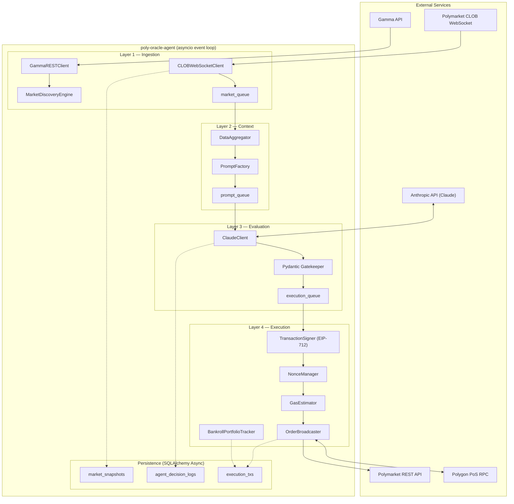

# poly-oracle-agent

## 1. Project Overview

`poly-oracle-agent` is an autonomous AI-powered trading agent for [Polymarket](https://polymarket.com). The system streams live orderbook data via WebSocket, aggregates market context, evaluates trading opportunities using Claude (Anthropic LLM) with structured Chain-of-Thought reasoning, and executes EIP-712 signed orders on the Polymarket CLOB with on-chain settlement on Polygon PoS.

The agent operates as a fully async (`asyncio`) pipeline with four isolated processing layers connected by `asyncio.Queue` bridges.

Current project state:
- **Version:** 0.14.0
- **Status:** Phase 14 — WI-48 (deployment hardening) merged; WI-49 (secure dashboard access) in review
- **Tests:** 1171 automated tests passing
- **Coverage:** 93% (target: ≥ 80%)
- **CI:** GitHub Actions pipeline at `.github/workflows/ci.yml` with blocking jobs `format-check` -> `test` -> `docker-build`

Core stack:
- Python 3.12+
- `asyncio` concurrency (all I/O is non-blocking)
- Pydantic V2 + `pydantic-settings`
- SQLAlchemy 2.0 Async + `aiosqlite`
- `httpx` async HTTP client
- `websockets` for CLOB stream ingestion
- `anthropic` for Claude evaluation
- `web3.py` for Polygon PoS / EIP-712 signing
- `structlog` for structured logging
- Alembic for schema migrations

---

## 2. Prerequisites

- **Python 3.12+** (project metadata allows 3.11+, but 3.12+ is the engineering standard)
- **Git**
- Network access to Polymarket CLOB WebSocket, Gamma API, Polygon RPC, and Anthropic API

### Required Secrets

For live trading these must be set in `.env`. In `DRY_RUN=true`, wallet credentials are optional and `AppConfig` hydrates exact safe fallbacks so the orchestrator can boot without signing capability. If `POLYGON_RPC_URL` is missing or malformed in dry run, `AppConfig` normalizes it to the exact Ankr Polygon endpoint `https://rpc.ankr.com/polygon` so `web3.py` transport construction does not fail at startup.

| Variable | Description |
|---|---|
| `ANTHROPIC_API_KEY` | Anthropic API key for Claude evaluations |
| `POLYGON_RPC_URL` | Polygon PoS JSON-RPC endpoint (required when `DRY_RUN=false`; dry run falls back to `https://rpc.ankr.com/polygon`) |
| `WALLET_ADDRESS` | Checksummed EIP-55 Ethereum address (required when `DRY_RUN=false`; dry run falls back to `0x1111111111111111111111111111111111111111`) |
| `WALLET_PRIVATE_KEY` | Hex-encoded private key for EIP-712 order signing (required when `DRY_RUN=false`; dry run falls back to `0x` + 64 `'1'` chars) |

All other variables have defaults and are documented in [Section 5: Configuration](#5-configuration).

Quick start:

```bash
cp .env.example .env
# Edit .env and fill in Anthropic credentials
# Add a real Polygon RPC URL before any live (`DRY_RUN=false`) execution
# Add wallet credentials before any live (`DRY_RUN=false`) execution
# Keep DRY_RUN=true for local development, CI, and validation runs
```

---

## 3. Installation

From repository root:

```bash
python3 -m venv venv
source venv/bin/activate
python -m pip install --upgrade pip
pip install -e .
```

The editable install (`-e .`) is recommended for development. For a non-editable install:

```bash
pip install .
```

---

## 4. Database Setup

Alembic is the **only** supported schema management path. Do not use `Base.metadata.create_all()` in runtime or deployment paths.

```bash
alembic upgrade head
```

This applies all migrations from `migrations/versions/` (baseline: `0001_initial_schema.py`, current: `0005`) and creates the core tables:
- `market_snapshots` — point-in-time orderbook captures (accessed via `MarketRepository`)
- `agent_decision_logs` — full LLM evaluation audit trail (accessed via `DecisionRepository`)
- `execution_txs` — on-chain transaction records (accessed via `ExecutionRepository`)
- `positions` — position lifecycle records (accessed via `PositionRepository`)

All runtime persistence is routed through repository classes in `src/db/repositories/`. No agent code accesses the database directly.

Default database: `sqlite+aiosqlite:///./poly_oracle.db` (override via `DATABASE_URL` in `.env`).

---

## 5. Configuration

Configuration is loaded by `AppConfig` (`src/core/config.py`) from environment variables and `.env`. Copy `.env.example` as your starting template.

### Environment Variable Reference

#### Anthropic

| Variable | Type | Default | Required | Description |
|---|---|---|---|---|
| `ANTHROPIC_API_KEY` | SecretStr | — | Yes | API key for Claude |
| `ANTHROPIC_MODEL` | str | `claude-3-5-sonnet-20241022` | No | Model ID |
| `ANTHROPIC_MAX_TOKENS` | int | `4096` | No | Max response tokens |
| `ANTHROPIC_MAX_RETRIES` | int | `2` | No | Retries on JSON validation failure |

#### LLM Provider Selection (WI-54)

| Variable | Type | Default | Required | Description |
|---|---|---|---|---|
| `LLM_PROVIDER` | str | `anthropic` | No | LLM evaluation provider: `anthropic` (default) or `deepseek` |
| `DEEPSEEK_API_KEY` | SecretStr | `""` | When provider=`deepseek` | API key for DeepSeek |
| `DEEPSEEK_BASE_URL` | str | `https://api.deepseek.com/anthropic` | No | DeepSeek Anthropic-compatible endpoint base URL |
| `DEEPSEEK_MODEL` | str | `deepseek-chat` | No | DeepSeek model identifier |
| `DEEPSEEK_MAX_TOKENS` | int | `4096` | No | Max output tokens per DeepSeek call |
| `DEEPSEEK_MAX_RETRIES` | int | `2` | No | Max retries on malformed DeepSeek responses |

> **Provider selection:** `ClaudeClient` is the single canonical evaluation client for both providers. When `LLM_PROVIDER=deepseek`, the existing `anthropic` SDK is used against the DeepSeek-compatible base URL. The class name `ClaudeClient` is never renamed or aliased. No `openai` SDK is introduced. Provider configuration fails closed at startup when DeepSeek is selected without an API key.

#### LLM Budget Guard

| Variable | Type | Default | Required | Description |
|---|---|---|---|---|
| `ENABLE_LLM_COST_GUARD` | bool | `true` | No | Enforces LLM budget checks before paid provider calls. |
| `LLM_HOURLY_CALL_LIMIT` | int | `240` | No | Primary evaluation calls per rolling hour; `0` blocks primary calls. |
| `LLM_REFLECTION_HOURLY_CALL_LIMIT` | int | `240` | No | Reflection audit calls per rolling hour; `0` blocks reflection calls. |
| `LLM_DAILY_CALL_LIMIT` | int | `2000` | No | Total daily provider calls across primary and reflection. |
| `LLM_DAILY_TOKEN_LIMIT` | int | `1000000` | No | Total rolling daily provider tokens across primary and reflection; Run 3 dry-run calibration uses `10000000`. |
| `LLM_DAILY_COST_LIMIT_USD` | Decimal | `10` | No | Total rolling daily estimated provider spend in USD; raise alongside token limits for sustained DeepSeek dry-runs. |
| `LLM_MARKET_HOURLY_CALL_LIMIT` | int | `60` | No | Total primary + reflection calls per market per hour; Run 5 dry-run calibration uses `120`. |

#### Market Discovery / Evaluation Allocation

| Variable | Type | Default | Required | Description |
|---|---|---|---|---|
| `ENABLE_MARKET_DISCOVERY_PREFLIGHT` | bool | `false` | No | Enables bounded order-book preflight before activation. |
| `MARKET_DISCOVERY_MAX_PREFLIGHT_CANDIDATES` | int | `10` | No | Maximum candidates checked per discovery cycle when preflight is enabled. |
| `PREFLIGHT_MAX_SPREAD_PCT` | Decimal | `0.05` | No | Maximum `spread / best_ask` allowed by preflight. Run 5 dry-run calibration uses `0.90` to reject extreme-spread markets while avoiding the all-blocking `0.80` calibration. |
| `ENABLE_CATEGORY_EVALUATION_CADENCE` | bool | `false` | No | Enables category-aware evaluation cadence throttling before prompt queue insertion. |
| `GROK_ELIGIBLE_EVALUATION_INTERVAL_SEC` | Decimal | `30` | No | Minimum seconds between evaluations for Grok-eligible markets. |
| `NON_GROK_EVALUATION_INTERVAL_SEC` | Decimal | `120` | No | Minimum seconds between evaluations for non-Grok-eligible markets. |
| `CULTURE_EVALUATION_INTERVAL_SEC` | Decimal | `600` | No | Minimum seconds between CULTURE evaluations while preserving live Grok sentiment coverage for CULTURE markets. |
| `OPERATIONAL_EVENT_DIAGNOSTIC_THROTTLE_SEC` | Decimal | `60` | No | Durable-ledger throttle for high-frequency diagnostic event types while preserving metrics. |

#### Polygon / Web3

| Variable | Type | Default | Required | Description |
|---|---|---|---|---|
| `POLYGON_RPC_URL` | str | — | Live only | Polygon PoS JSON-RPC URL; dry-run boot uses the exact `https://rpc.ankr.com/polygon` fallback when unset or malformed |
| `WALLET_ADDRESS` | str | — | Live only | Checksummed EIP-55 address; dry-run boot uses the exact `0x1111111111111111111111111111111111111111` fallback when unset |
| `WALLET_PRIVATE_KEY` | SecretStr | — | Live only | Hex private key for signing; dry-run boot uses the exact `0x` + 64 `'1'` chars fallback when unset |

#### Polymarket CLOB

| Variable | Type | Default | Required | Description |
|---|---|---|---|---|
| `CLOB_REST_URL` | str | `https://clob.polymarket.com` | No | CLOB REST API base URL |
| `CLOB_WS_URL` | str | `wss://ws-subscriptions-clob.polymarket.com/ws/market` | No | CLOB WebSocket URL |
| `GAMMA_API_URL` | str | `https://gamma-api.polymarket.com` | No | Gamma market metadata API |

#### Risk Parameters

| Variable | Type | Default | Required | Description |
|---|---|---|---|---|
| `KELLY_FRACTION` | float | `0.25` | No | Quarter-Kelly multiplier |
| `MIN_CONFIDENCE` | float | `0.75` | No | Minimum LLM confidence score (75%) |
| `MAX_SPREAD_PCT` | float | `0.015` | No | Maximum orderbook spread (1.5%) |
| `MAX_EXPOSURE_PCT` | float | `0.03` | No | Maximum single-trade exposure (3% of bankroll) |
| `ENABLE_EXPOSURE_VALIDATOR` | bool | `false` | No | Enables WI-30 pre-routing portfolio exposure gate in `Orchestrator._execution_consumer_loop()` |
| `MAX_CATEGORY_EXPOSURE_PCT` | Decimal | `0.015` | No | Per-category exposure cap used by WI-30 `ExposureValidator` |
| `ENABLE_WALLET_BALANCE_CHECK` | bool | `false` | No | Enables WI-31 live wallet balance gate before gas/evaluation routing |
| `MIN_MATIC_BALANCE_WEI` | Decimal | `100000000000000000` | No | WI-31 minimum MATIC threshold (0.1 MATIC in WEI) |
| `MIN_USDC_BALANCE_USDC` | Decimal | `10` | No | WI-31 minimum USDC threshold (human-readable units) |
| `MIN_EV_THRESHOLD` | float | `0.02` | No | Minimum expected value edge (2%) |
| `MIN_TTR_HOURS` | float | `4.0` | No | Minimum hours to market resolution |

#### Bankroll

| Variable | Type | Default | Required | Description |
|---|---|---|---|---|
| `INITIAL_BANKROLL_USDC` | Decimal | `1000` | No | Mock bankroll used when `DRY_RUN=true`; live sizing reads Polygon USDC balance on each evaluation |

#### Execution Router

| Variable | Type | Default | Required | Description |
|---|---|---|---|---|
| `MAX_ORDER_USDC` | Decimal | `50` | No | Hard cap on any single WI-16 routed order in USDC |
| `MAX_SLIPPAGE_TOLERANCE` | Decimal | `0.02` | No | Maximum allowed `best_ask` deviation above midpoint before routing fails closed |

#### Exit Scan (WI-22)

| Variable | Type | Default | Required | Description |
|---|---|---|---|---|
| `EXIT_SCAN_INTERVAL_SECONDS` | Decimal | `60` | No | Periodic cadence for `ExitStrategyEngine.scan_open_positions()` in `ExitScanTask` |

#### Portfolio Aggregator (WI-23)

| Variable | Type | Default | Required | Description |
|---|---|---|---|---|
| `ENABLE_PORTFOLIO_AGGREGATOR` | bool | `false` | No | Enables optional `PortfolioAggregatorTask` in orchestrator |
| `PORTFOLIO_AGGREGATION_INTERVAL_SEC` | Decimal | `30` | No | Periodic cadence for `PortfolioAggregator.compute_snapshot()` |

#### Alert Engine (WI-25)

| Variable | Type | Default | Required | Description |
|---|---|---|---|---|
| `ALERT_DRAWDOWN_USDC` | Decimal | `100` | No | Fires CRITICAL drawdown alert when `total_unrealized_pnl < -threshold` |
| `ALERT_STALE_PRICE_PCT` | Decimal | `0.50` | No | Fires WARNING stale-price alert when `stale/total > threshold` |
| `ALERT_MAX_OPEN_POSITIONS` | int | `20` | No | Fires WARNING position-count alert when open positions exceed threshold |
| `ALERT_LOSS_RATE_PCT` | Decimal | `0.60` | No | Fires WARNING loss-rate alert when `losing/settled > threshold` |

#### Telegram Notifier (WI-26)

| Variable | Type | Default | Required | Description |
|---|---|---|---|---|
| `ENABLE_TELEGRAM_NOTIFIER` | bool | `false` | No | Enables Telegram delivery for alerts and BUY/SELL routing summaries |
| `TELEGRAM_BOT_TOKEN` | SecretStr | `""` | No | Telegram Bot API token from `@BotFather`; feature stays disabled when empty |
| `TELEGRAM_CHAT_ID` | str | `""` | No | Telegram chat ID that receives notifications; feature stays disabled when empty |
| `TELEGRAM_SEND_TIMEOUT_SEC` | Decimal | `5` | No | Hard timeout for each Telegram `sendMessage` request |

#### Circuit Breaker (WI-27)

| Variable | Type | Default | Required | Description |
|---|---|---|---|---|
| `ENABLE_CIRCUIT_BREAKER` | bool | `false` | No | Enables the global in-memory circuit breaker that blocks new BUY routing on CRITICAL drawdown alerts |
| `CIRCUIT_BREAKER_OVERRIDE_CLOSED` | bool | `false` | No | One-shot manual override that forces the breaker back to `CLOSED` on the next alert-evaluation cycle |

#### Exit Order Router (WI-20)

| Variable | Type | Default | Required | Description |
|---|---|---|---|---|
| `EXIT_MIN_BID_TOLERANCE` | Decimal | `0.01` | No | Minimum acceptable `best_bid` for SELL-side exit routing; lower bids fail with `exit_bid_below_tolerance` |

#### Gas

| Variable | Type | Default | Required | Description |
|---|---|---|---|---|
| `MAX_GAS_PRICE_GWEI` | float | `500.0` | No | Hard ceiling — raises error above this |
| `FALLBACK_GAS_PRICE_GWEI` | float | `50.0` | No | Fixed price when RPC is unreachable |

#### Database

| Variable | Type | Default | Required | Description |
|---|---|---|---|---|
| `DATABASE_URL` | str | `sqlite+aiosqlite:///./poly_oracle.db` | No | SQLAlchemy async connection string |

#### Grok Sentiment Oracle

| Variable | Type | Default | Required | Description |
|---|---|---|---|---|
| `GROK_API_KEY` | SecretStr | `""` | Live Grok only | xAI/Grok API key. Missing or invalid keys fall back to neutral sentiment. |
| `GROK_MOCKED` | bool | `true` | No | Uses deterministic sentiment and makes no live xAI request. |
| `GROK_LIVE_ENABLED` | bool | `false` | No | Explicit gate for live xAI/Grok calls; requires `GROK_MOCKED=false` and a key. |
| `GROK_TIMEOUT_SECONDS` | float | `2.0` | No | Per-attempt live Grok timeout. In `DRY_RUN=true`, retries can use the full configured Grok budget rather than the 2s live-trading chain cap. |
| `GROK_MAX_RETRIES` | int | `2` | No | Maximum live Grok retries before neutral fallback. |

#### Concurrent Market Tracking

| Variable | Type | Default | Required | Description |
|---|---|---|---|---|
| `ENABLE_MARKET_TRACKING` | bool | `false` | No | `false` keeps the conservative single-primary-market runtime; set `true` to fan out subscriptions. |
| `MAX_CONCURRENT_MARKETS` | int | `5` | No | Maximum discovered markets to track when concurrent market tracking is enabled. |
| `MARKET_TRACKING_INTERVAL_SEC` | Decimal | `10` | No | Discovery refresh cadence for the market-tracking task. |

#### Operational

| Variable | Type | Default | Required | Description |
|---|---|---|---|---|
| `LOG_LEVEL` | str | `INFO` | No | Allowed: `DEBUG`, `INFO`, `WARNING`, `ERROR` |
| `DRY_RUN` | bool | `false` (AppConfig fallback) | No | **Required value: `true` for local development, CI, and validation runs; only set `false` for controlled post-Phase-3 live operations** |

> **Important:** `DRY_RUN=true` is the required default for local development, CI, and all validation runs. See [Section 11: Operational Notes](#11-operational-notes) for details.

---

## 6. Running the Agent

After environment setup and migration:

```bash
python -m src.orchestrator
```

### Startup Sequence

1. Loads and validates `AppConfig` from `.env`
2. Initializes async database engine and session factory
3. Runs market discovery via `GammaRESTClient` + `MarketDiscoveryEngine`
4. Selects the best eligible market (exits if none found)
5. Wires the four-layer queue pipeline and launches 6 baseline concurrent tasks:
   - **IngestionTask** — `CLOBWebSocketClient` streams market events
   - **ContextTask** — `DataAggregator` maintains state + `PromptFactory` builds prompts
   - **EvaluationTask** — `ClaudeClient` evaluates and routes decisions
   - **ExecutionTask** — Signs and broadcasts approved orders (blocked in dry_run)
   - **DiscoveryTask** — Re-runs market discovery every 5 minutes
   - **ExitScanTask** — Runs periodic open-position exit scans (sleep-first loop)
   - **PortfolioAggregatorTask** *(optional)* — Runs periodic read-only portfolio snapshots, lifecycle reports, and WI-25 alert evaluation when `ENABLE_PORTFOLIO_AGGREGATOR=true`
6. If `ENABLE_TELEGRAM_NOTIFIER=true` and Telegram credentials are present, WI-26 sends Telegram alerts and BUY/SELL routing summaries inline from existing loops using a dedicated `httpx.AsyncClient` and no extra task.
7. If `ENABLE_CIRCUIT_BREAKER=true`, WI-27 adds a synchronous in-memory gate before `ExecutionRouter.route()`. CRITICAL `drawdown` alerts trip it to `OPEN`, blocking new BUY routing while leaving the SELL-side exit path fully operational.
8. If `CIRCUIT_BREAKER_OVERRIDE_CLOSED=true`, the next portfolio aggregation cycle force-closes the breaker once, then auto-resets the flag in memory.
9. If `ENABLE_EXPOSURE_VALIDATOR=true`, WI-30 validates current open exposure (`SUM(order_size_usdc)` on SQLite `positions` where `status='OPEN'`) before routing. Breaches short-circuit with `ExecutionResult(action=SKIP, reason="exposure_limit_exceeded")`.
10. If `ENABLE_WALLET_BALANCE_CHECK=true`, WI-31 runs concurrent MATIC (`eth_getBalance`) and USDC (`eth_call` `balanceOf`) checks after WI-30 and before WI-29. Confirmed insufficiency short-circuits with `ExecutionResult(action=SKIP, reason="insufficient_wallet_balance")`; RPC failures are fail-open (`fallback_used=true`, route continues).

Graceful shutdown on `Ctrl+C`: stops components, cancels tasks, closes HTTP clients, disposes database engine.

---

### Offline Backtesting CLI (WI-33)

Run historical offline replay (JSON-in, JSON-out):

```bash
python -m src.backtest_runner --data-dir /path/to/historical --output ./output/backtest_report.json
```

Optional config override file (JSON or YAML when `PyYAML` is installed):

```bash
python -m src.backtest_runner \
  --data-dir /path/to/historical \
  --config ./configs/backtest_config.json \
  --output ./output/backtest_report.json
```

Notes:
- Backtesting enforces `dry_run=True` by invariant and rejects live execution mode.
- Historical snapshots are replayed in strict chronological order.
- Output persistence is JSON report only (no DB write path).

---

### Dashboard / UI (Phase 12)

Launch the local read-only operator dashboard:

```bash
uv run streamlit run src/ui/dashboard.py
```

Or with a plain `venv`:

```bash
streamlit run src/ui/dashboard.py
```

The dashboard connects to `poly_oracle.db` in the project root and exposes four sections:

| Section | Content |
|---|---|
| **System Vitals** (sidebar) | DB connectivity status, query latency, last-refresh timestamp, manual refresh button |
| **Performance Metrics** | Five `st.metric` cards: Realized PnL, Win Rate, Open Exposure, Total Decisions, Active Positions |
| **PnL Over Time** | Plotly cumulative PnL chart (solid = live data; dotted = mock placeholder when no closed positions) |
| **LLM Decision Audit Log** | Last 20 LLM decisions with confidence%, EV%, Kelly%, and full reasoning text |
| **Market Watch** | All tracked markets sorted by 24h volume; yes/no prices and end date |

All DB queries are read-only. The dashboard never writes to `poly_oracle.db`. Cache TTL is 30 seconds; use the **Refresh View** sidebar button to force an immediate reload.

The dashboard works on an empty database — all sections display graceful empty states rather than raising exceptions.

---

## 7. Running Tests

Run full suite:

```bash
python -m pytest --asyncio-mode=auto tests/
```

Run with coverage:

```bash
python -m coverage run -m pytest tests/ --asyncio-mode=auto
python -m coverage report -m
```

Run focused tests:

```bash
python -m pytest tests/unit/test_schemas.py -v
python -m pytest tests/unit/test_nonce_manager.py -v
python -m pytest tests/unit/test_circuit_breaker.py -v
python -m pytest tests/integration/test_circuit_breaker_integration.py -v
```

Current baseline:
- 678 tests
- 94% coverage (target: ≥ 80%)

New code must not decrease coverage below 80%.

---

## 8. Git Workflow

Branching and PR flow:
1. Branch from `develop`.
2. Make one logical (atomic) change per commit.
3. Open PR from `develop` to `main`.
4. Merge only after tests pass and review is complete.

Commit message format:
- `feat(scope): description`
- `fix(scope): description`
- `perf(scope): description`
- `docs(scope): description`
- `chore(scope): description`

Guardrails:
- Never commit `.env`, `venv/`, `*.pyc`, or `__pycache__/`
- No WIP-style commits on shared branches
- Never commit directly to `main`

---

## 9. Architecture Overview

The runtime is a four-layer async pipeline running inside a single `asyncio` event loop. Layers communicate exclusively via `asyncio.Queue` instances.

```
Layer 1: Ingestion → Layer 2: Context → Layer 3: Evaluation → Layer 4: Execution
     ↓ market_queue      ↓ prompt_queue       ↓ execution_queue
  (MarketSnapshot)    (Prompt + State)      (SignedDecision)
```


```mermaid
graph TB
    subgraph External["External Services"]
        PM_WS["Polymarket CLOB WebSocket"]
        PM_REST["Polymarket REST API"]
        GAMMA["Gamma API"]
        ANTHROPIC["Anthropic API (Claude)"]
        POLYGON["Polygon PoS RPC"]
    end

    subgraph Core["poly-oracle-agent (asyncio event loop)"]
        direction TB

        subgraph L1["Layer 1 — Ingestion"]
            WS["CLOBWebSocketClient"]
            REST["GammaRESTClient"]
            MDE["MarketDiscoveryEngine"]
            MQ["market_queue"]
        end

        subgraph L2["Layer 2 — Context"]
            AGG["DataAggregator"]
            PF["PromptFactory"]
            PQ["prompt_queue"]
        end

        subgraph L3["Layer 3 — Evaluation"]
            CC["ClaudeClient"]
            GATE["Pydantic Gatekeeper"]
            EQ["execution_queue"]
        end

        subgraph L4["Layer 4 — Execution"]
            SIGNER["TransactionSigner (EIP-712)"]
            NONCE["NonceManager"]
            GAS["GasEstimator"]
            BCAST["OrderBroadcaster"]
            BPT["BankrollPortfolioTracker"]
        end

        subgraph DB["Persistence (SQLAlchemy Async)"]
            SNAP["market_snapshots"]
            DEC["agent_decision_logs"]
            TX["execution_txs"]
        end
    end

    PM_WS --> WS
    GAMMA --> REST
    REST --> MDE
    WS --> MQ
    MQ --> AGG
    AGG --> PF --> PQ
    PQ --> CC
    ANTHROPIC <--> CC
    CC --> GATE --> EQ
    EQ --> SIGNER --> NONCE --> GAS --> BCAST
    BCAST <--> POLYGON
    BCAST --> PM_REST

    WS -.-> SNAP
    CC -.-> DEC
    BCAST -.-> TX
    BPT -.-> TX
```

### Layer Details

| Layer | Components | Responsibility |
|---|---|---|
| **1. Ingestion** | `CLOBWebSocketClient`, `GammaRESTClient`, `MarketDiscoveryEngine` | Stream and validate market events; discover eligible markets; persist snapshots via injectable `MarketRepository` factory |
| **2. Context** | `DataAggregator`, `PromptFactory` | Maintain orderbook state; emit on time/volatility triggers; build structured CoT prompts |
| **3. Evaluation** | `ClaudeClient` + Pydantic Gatekeeper (`LLMEvaluationResponse`) | Query Claude; validate and enforce 5 safety filters; persist decisions via injectable `DecisionRepository` factory; route approved trades |
| **4. Execution** | `ExecutionRouter`, `BankrollSyncProvider`, `PositionTracker`, `ExitStrategyEngine`, `ExitOrderRouter`, `TransactionSigner`, `NonceManager`, `GasEstimator`, `OrderBroadcaster`, `BankrollPortfolioTracker` | Read live Polygon USDC bankroll, route validated BUY decisions into capped/slippage-checked order payloads, track position lifecycle, evaluate exit criteria, route actionable exits into SELL-side orders, sign EIP-712 orders, manage nonces, estimate gas, broadcast to CLOB, and persist/query execution state via `ExecutionRepository` and `PositionRepository` |

### Safety Filters (Gatekeeper)

All filters must pass simultaneously for `decision_boolean = True`:

| Filter | Threshold | Purpose |
|---|---|---|
| Expected Value | EV > 2% | Minimum edge to overcome costs |
| Confidence | ≥ 75% | Kelly requires reliable probability estimate |
| Spread | ≤ 1.5% | Thin liquidity destroys EV |
| Exposure | ≤ 3% of bankroll | Catastrophic loss cap per trade |
| Time-to-Resolution | ≥ 4 hours | Near-expiry markets are too volatile |

Position sizing: `min(quarter_kelly × bankroll, 0.03 × bankroll)` where quarter_kelly = `0.25 × f*`.

---

## 10. Financial Integrity & Numeric Safety

**Critical Constraint:** All USDC and price calculations use Python's `Decimal` type to prevent floating-point precision loss.

### No Float Arithmetic for Financial Calculations

**Why?** IEEE 754 floating-point arithmetic introduces cumulative rounding errors in financial calculations. A single unsafe division like `order_amount / 1_000_000` can introduce precision loss that cascades into exposure miscalculations and bankroll tracking errors.

**Implementation:**

1. **USDC Size Calculation** (`OrderBroadcaster._build_execution_row()`):
   ```python
   from decimal import Decimal
   size_usdc = Decimal(str(order.maker_amount)) / Decimal('1e6')
   ```
   - Converts integer microUSDC to Decimal USDC
   - String casting prevents implicit float conversion
   - All tests verify Decimal type at storage time

2. **Exposure Aggregation** (`ExecutionRepository.get_aggregate_exposure()`):
   ```python
   raw = await session.execute(select(func.sum(ExecutionTx.size_usdc)))
   return Decimal(str(raw.scalar_one_or_none() or 0))
   ```
   - Database sum results cast via `str()` before Decimal conversion
   - Prevents float→Decimal contamination

3. **Position Sizing** (`BankrollPortfolioTracker.compute_position_size()`):
   ```python
   kelly_frac = Decimal(str(config.kelly_fraction))  # 0.25
   kelly_size = kelly_frac * kelly_fraction_raw * bankroll
   exposure_cap = Decimal(str(config.max_exposure_pct)) * bankroll
   position_size = min(kelly_size, exposure_cap)
   ```
   - All config parameters cast to Decimal
   - All intermediate values are Decimal

### Verification

- `pytest tests/unit/test_broadcaster.py -v` — 9/9 pass with Decimal implementation
- All bankroll calculations in `tests/unit/test_bankroll.py` assert Decimal type
- Search verification: `grep -r "size_usdc.*/" src/agents/` returns zero float divisions

---

## 11. Server-Side Operations (Phase 16+)

### WI-61: Periodic Runtime Audit

The server runs an autonomous safety audit every 15 minutes that probes health endpoints, database state, Docker service status, and bounded log summaries. Artifacts are written to `docs/operations/runtime_audits/`.

**On DigitalOcean Droplet:**

```bash
# Check audit timer status
systemctl status poly-oracle-runtime-audit.timer

# View latest audit output
cat docs/operations/runtime_audits/latest.json

# View audit history
ls -lt docs/operations/runtime_audits/
```

**Exit codes:** `0` = healthy, `1` = degraded, `2` = safety-gate failure, `3` = probe error

### WI-62: Server Runtime Review

Every 24 hours, the server autonomously reviews the last 72 hours of WI-61 audit artifacts and produces a structured observation report (and conditional fix plan) in `docs/runtime_observations/`.

**On DigitalOcean Droplet:**

```bash
# Check review timer status
systemctl status poly-oracle-server-review.timer

# Trigger manual review
systemctl start poly-oracle-server-review.service

# View review output
journalctl -u poly-oracle-server-review.service --since "1 hour ago"

# View generated reports
ls -lt docs/runtime_observations/
```

**Architecture:**
- Runs headlessly via OpenCode CLI (`opencode run --command server-runtime-review`)
- Uses DeepSeek provider for LLM synthesis (all arithmetic done by Python aggregator)
- Writes reports to `docs/runtime_observations/{YYYY-MM-DD}-server-runtime-session.md`
- Generates fix plan only if thresholds are breached (errors > 50, safety gates > 0, etc.)

### Local Development Note

WI-61/WI-62 are **server-side only** operations. Running `/server-runtime-review` locally will abort because audit artifacts exist only on the deployment server. To review server health locally:

```bash
# SSH to server and view reports
ssh root@159.223.130.81 'cat /opt/poly-oracle-agent/docs/runtime_observations/latest.md'

# Or trigger a fresh review
ssh root@159.223.130.81 'systemctl start poly-oracle-server-review.service'
```

---

## 12. Operational Notes

> **This system is not live-trading ready.** Phase 3 must be fully complete before any live execution. Always set `DRY_RUN=true` for local development, CI, and validation runs.

### `dry_run` Behavior

When `DRY_RUN=true`:
- **Runs normally:** Ingestion (WebSocket streaming), context building, LLM evaluation, decision persistence
- **Blocked:** EIP-712 order signing, CLOB order broadcasting, on-chain execution
- Approved decisions are logged with `execution.dry_run_skip` but no orders are submitted

When `DRY_RUN=false`:
- Full pipeline including order signing and broadcasting is active
- **Only use after Phase 3 success criteria are met and with real credentials**

### Schema Management

Alembic is the only supported schema management path. Never use `Base.metadata.create_all()` in production or development workflows. All schema changes must go through migration revisions in `migrations/versions/`.

### Troubleshooting

| Symptom | Likely Cause | Resolution |
|---|---|---|
| `Configuration validation failed` at startup | Missing or invalid `.env` values | Check all 4 required secrets are set; verify `WALLET_ADDRESS` is checksummed EIP-55 |
| `orchestrator.no_eligible_markets_at_startup` | No markets pass discovery filters | Verify Gamma API is reachable; check `MIN_TTR_HOURS` and `MAX_EXPOSURE_PCT` thresholds |
| WebSocket disconnects / reconnect loops | Network instability or CLOB endpoint down | Built-in exponential backoff (1s → 60s); check `CLOB_WS_URL` |
| `GasEstimatorError` | Gas price exceeds `MAX_GAS_PRICE_GWEI` ceiling (500 Gwei) | Polygon network congestion; wait or raise ceiling |
| `ExposureLimitError` | Trade exceeds exposure cap or available bankroll | Expected safety behavior; wait for positions to resolve or, in `DRY_RUN=true`, adjust `INITIAL_BANKROLL_USDC` mock balance |
| Empty test results | Dependencies not installed | Run `pip install -e .` then `python -m pytest --asyncio-mode=auto tests/` |
