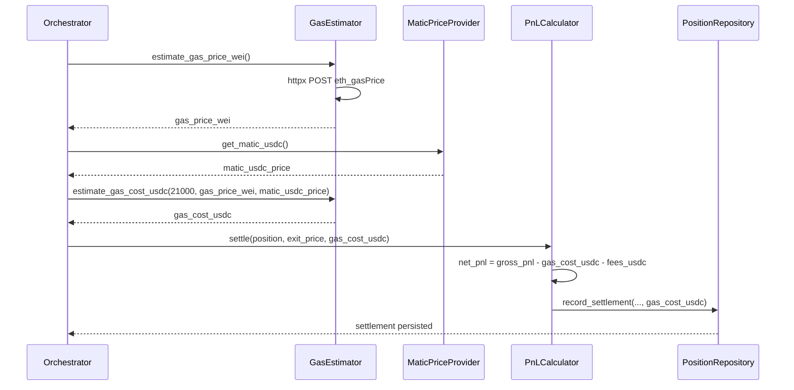
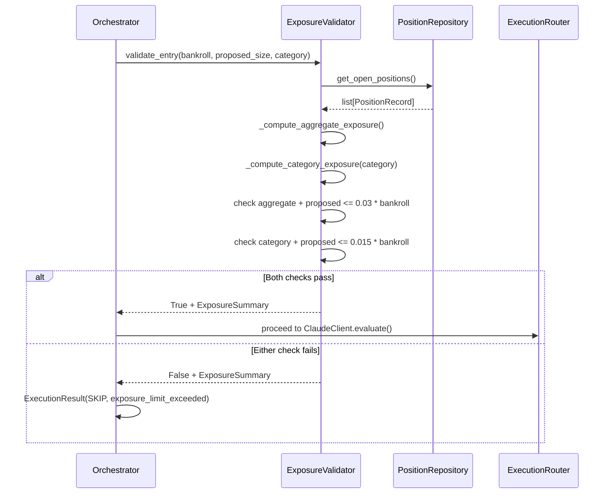
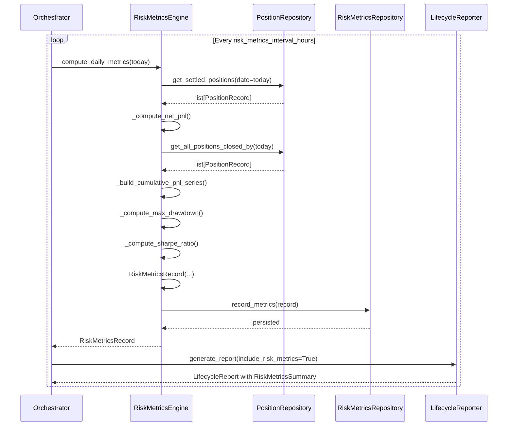
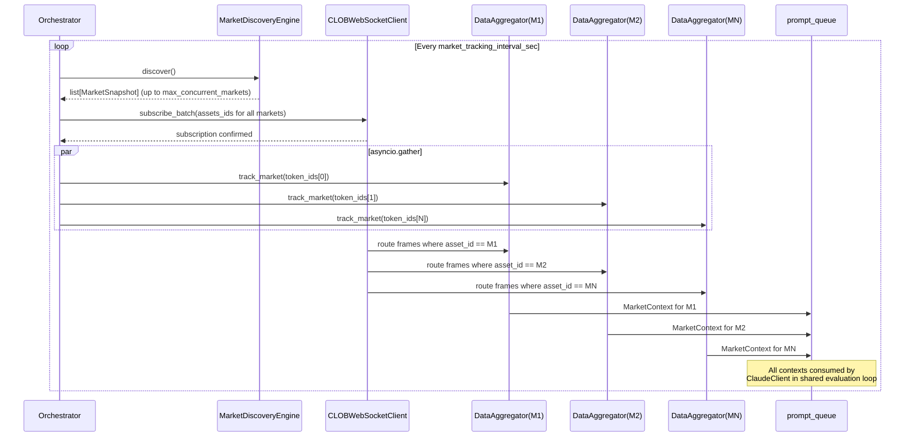
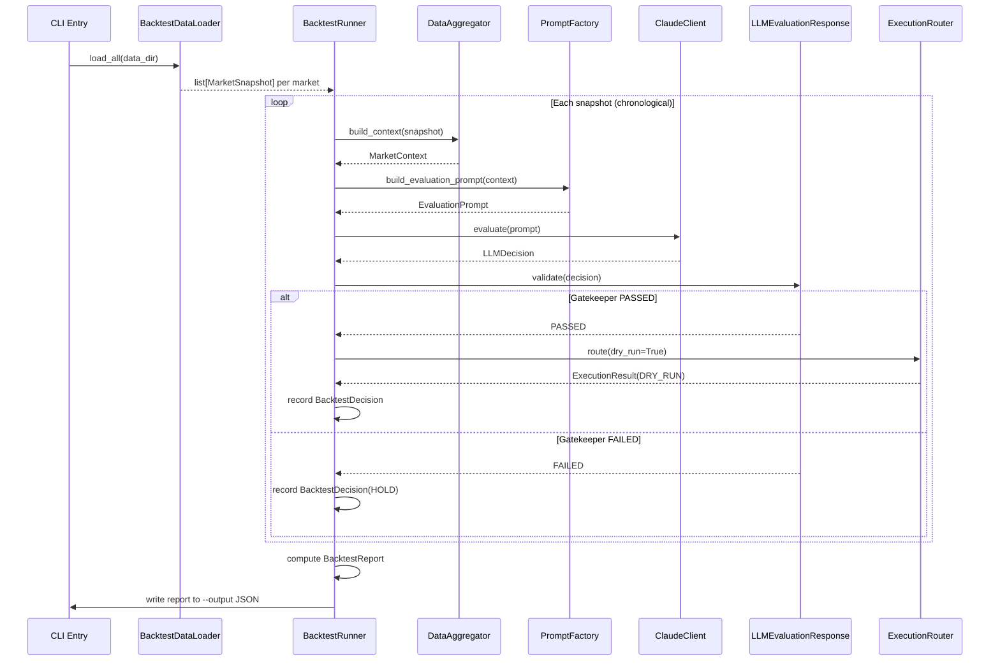
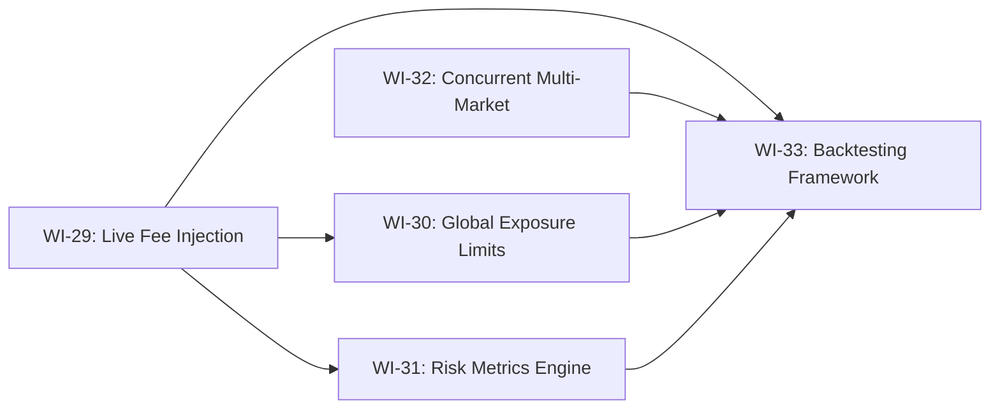

# PRD v10.0 - Poly-Oracle-Agent Phase 10

Source inputs: `docs/PRD-v9.0.md`, `STATE.md`, `docs/archive/ARCHIVE_PHASE_9.md`, `docs/archive/ARCHIVE_PHASE_8.md`, `docs/system_architecture.md`, `docs/risk_management.md`, `docs/business_logic.md`, `src/orchestrator.py`, `src/core/config.py`, `src/schemas/risk.py`, `src/schemas/execution.py`, `src/db/models.py`, `src/db/repositories/position_repository.py`, `src/agents/ingestion/ws_client.py`, `src/agents/context/aggregator.py`, `src/agents/evaluation/claude_client.py`, `AGENTS.md`.

## 1. Executive Summary

Phase 9 closed the operator-safety loop: real-time Telegram telemetry, a portfolio-level circuit breaker that halts BUY routing on critical drawdown, and fee-aware net PnL accounting that distinguishes gross from true profitability. The system can now observe degradation, act on it autonomously, and report accurate financial outcomes.

Phase 10 shifts the system from a single-market, fee-blind, single-threaded evaluation loop into a production-grade, multi-market, economically-aware, concurrently-executing trading agent. It delivers five capabilities executed in strict dependency order:

1. **WI-29 — Live Fee Injection** connects the agent to a live Polygon RPC endpoint to fetch real-time `eth_gasPrice` and validate it against the Expected Value of proposed trades. When gas costs exceed the edge, the trade is rejected before reaching the Gatekeeper. This closes the loop between Layer 4 execution costs and Layer 3 evaluation decisions.

2. **WI-30 — Global Portfolio Exposure Limits** introduces cross-market exposure validation inside SQLite: before any new trade is queued, the system computes `SUM(position_size)` across all OPEN positions and blocks new entries if the aggregate exceeds the global risk cap (3% of bankroll, per `risk_management.md`). This is a portfolio-level gate, not a per-market gate.

3. **WI-31 — Advanced Risk Metrics Engine** adds an async end-of-day analytics script that computes net PnL, Maximum Drawdown, and Sharpe ratio from persisted position data. The metrics are stored in a new `risk_metrics_daily` table and surfaced via `LifecycleReport` extensions, enabling longitudinal performance tracking and future strategy optimization.

4. **WI-32 — Concurrent Multi-Market Tracking** refactors the `Orchestrator` and `DataAggregator` to use `asyncio.gather` for simultaneous WebSocket subscriptions across multiple markets. The current single-market sequential loop becomes a parallel fan-out, reducing latency from market ingestion to evaluation by the number of concurrent markets tracked.

5. **WI-33 — Backtesting Framework** introduces an offline simulator that injects historical CLOB JSON data directly into the `ClaudeClient` evaluation node, bypassing live WebSocket ingestion. The backtester replays historical market snapshots through the full 4-layer pipeline (with Gatekeeper intact) and produces a performance report, enabling strategy validation against historical data before deploying to production.

Phase 10 preserves the four-layer async architecture and the terminal authority of `LLMEvaluationResponse`. It introduces one new external I/O component (`GasEstimator` wires to Polygon RPC), one new portfolio-level gate (`ExposureValidator`), one new analytics pipeline (`RiskMetricsEngine`), one concurrency refactor (`asyncio.gather` in `DataAggregator`), and one offline execution path (`BacktestRunner`). All Decimal math invariants, repository isolation, and `dry_run` execution blocking remain in force.

## 2. Core Pillars

### 2.1 Real-Time Economic Awareness

Gas costs are not static. Polygon's `eth_gasPrice` fluctuates with network congestion, and CLOB taker/maker fees vary by market liquidity. Phase 10 injects live fee data into the evaluation pipeline so the agent can reject trades where the cost of execution erodes the expected edge — before any LLM call is made.

### 2.2 Portfolio-Level Risk Discipline

Per-market Kelly sizing and Gatekeeper filters are necessary but insufficient. The system must enforce a global exposure cap across ALL open positions to prevent correlated risk concentration. WI-30 computes aggregate exposure at the portfolio level and blocks new entries when the sum exceeds the 3% bankroll cap defined in `risk_management.md`.

### 2.3 Longitudinal Performance Tracking

Single-trade PnL is a point-in-time metric. Phase 10 introduces end-of-day analytics — Maximum Drawdown, Sharpe ratio, and cumulative net PnL — computed from persisted position data. These metrics enable the operator to track strategy performance over time and inform future parameter tuning (Kelly fraction, alert thresholds, circuit breaker triggers).

### 2.4 Concurrency at the Ingestion Layer

The current single-market sequential loop is a bottleneck. Phase 10 refactors `DataAggregator` to fan out concurrent WebSocket subscriptions via `asyncio.gather`, tracking multiple markets simultaneously. This reduces end-to-end latency from market change to evaluation decision, improving the agent's responsiveness to fast-moving odds.

### 2.5 Offline Strategy Validation

Deploying untested prompt modifications or gating thresholds to production is a financial risk. Phase 10 introduces a backtesting framework that replays historical CLOB data through the full evaluation pipeline — including the Gatekeeper — and produces a performance report. The operator can validate strategy changes against historical data before risking real capital.

## 3. Work Items

### WI-29: Live Fee Injection

**Objective**
Introduce `GasEstimator`, an async component that queries Polygon RPC for real-time `eth_gasPrice` and converts it into USDC-equivalent transaction costs. The `GasEstimator` is called by the `Orchestrator` BEFORE the `ClaudeClient` evaluation chain, enabling pre-evaluation gas cost validation: if the estimated gas cost exceeds the expected value of the proposed trade, the trade is short-circuited with a typed `SKIP` result and reason `"gas_cost_exceeds_ev"`.

When `dry_run=True`, `GasEstimator` returns a mock gas price (`AppConfig.dry_run_gas_price_wei`) to enable deterministic testing without live RPC calls. The pre-evaluation gate still fires, but with deterministic values.

The `GasEstimator` is also called during settlement in `PnLCalculator.settle()` to provide actual gas costs for net PnL accounting (completing the WI-28 fee-aware accounting loop with live data instead of manual parameter injection).

**Scope Boundaries**

In scope:
- New `GasEstimator` class in `src/agents/execution/gas_estimator.py` (extends existing stub from Phase 5)
- `estimate_gas_price_wei() -> Decimal` — async method; calls Polygon RPC `eth_gasPrice`, returns gas price in WEI
- `estimate_gas_cost_usdc(gas_units: int, gas_price_wei: Decimal, matic_usdc_price: Decimal) -> Decimal` — synchronous conversion from gas units × gas price into USDC
- `pre_evaluate_gas_check(expected_value_usdc: Decimal, gas_cost_usdc: Decimal) -> bool` — synchronous gate; returns `True` when gas_cost < EV, `False` otherwise
- Polygon RPC URL from `AppConfig.polygon_rpc_url`
- `httpx.AsyncClient.post()` to Polygon RPC with JSON-RPC `eth_gasPrice` payload
- New `AppConfig` fields:
  - `dry_run_gas_price_wei: Decimal` (default `Decimal("30000000000")` — 30 Gwei mock for dry run)
  - `gas_check_enabled: bool` (default `False`)
  - `gas_ev_buffer_pct: Decimal` (default `Decimal("0.10")` — requires EV to exceed gas cost by 10% margin)
- Orchestrator integration:
  - `GasEstimator` constructed in `Orchestrator.__init__()` (conditional on `gas_check_enabled`)
  - `estimate_gas_price_wei()` + `pre_evaluate_gas_check()` called in `_execution_consumer_loop()` BEFORE `ClaudeClient.evaluate()` — if gas check fails, the item is skipped with `ExecutionResult(action=SKIP, reason="gas_cost_exceeds_ev")`
  - `estimate_gas_cost_usdc()` called in `_exit_scan_loop()` during `PnLCalculator.settle()` to provide live gas cost for net PnL accounting
- structlog audit events: `gas.estimated`, `gas.check_failed`, `gas.check_passed`, `gas.settlement_computed`
- `MaticPriceProvider` — lightweight async component fetching MATIC/USDC price from Gamma REST or configured price oracle (fallback to `AppConfig.matic_usdc_price` static value)

Out of scope:
- Gas unit estimation per transaction type — `gas_units` is passed as a parameter (default `21000` for simple transfers, configurable per order type in future phase)
- Dynamic gas limit calculation based on order complexity
- EIP-1559 fee market support (Polygon uses legacy gas model)
- Modifications to `ClaudeClient`, `PromptFactory`, `LLMEvaluationResponse`, or Gatekeeper internals
- Gas cost injection in BUY order signing — gas is paid on-chain during settlement, not during order placement
- Historical gas price backfilling

**Components Delivered**

| Component | Location |
|---|---|
| `GasEstimator` | `src/agents/execution/gas_estimator.py` |
| `MaticPriceProvider` | `src/agents/execution/matic_price_provider.py` |
| Config: `gas_check_enabled` | `src/core/config.py` |
| Config: `dry_run_gas_price_wei` | `src/core/config.py` |
| Config: `gas_ev_buffer_pct` | `src/core/config.py` |
| Config: `matic_usdc_price` | `src/core/config.py` |

**Data Flow — Pre-Evaluation Gas Check**

```mermaid
flowchart LR
    A[ExecutionQueue Item] --> B{gas_check_enabled?}
    B -->|No| C[ClaudeClient.evaluate()]
    B -->|Yes| D[GasEstimator.estimate_gas_price_wei()]
    D --> E[MaticPriceProvider.get_matic_usdc()]
    E --> F[GasEstimator.estimate_gas_cost_usdc()]
    F --> G{pre_evaluate_gas_check\nEV > gas_cost * 1.10?}
    G -->|Yes| C
    G -->|No| H[SKIP: gas_cost_exceeds_ev]
    H --> I[ExecutionResult logged]
    C --> J[LLMEvaluationResponse Gatekeeper]
```

**Sequence — Settlement Gas Cost Injection**



**Key Invariants Enforced**

1. `GasEstimator` is fail-open. A failed `eth_gasPrice` RPC call catches ALL exceptions, logs via structlog, and returns the mock dry-run value (`dry_run_gas_price_wei`). It never raises into the caller.
2. The pre-evaluation gas check runs BEFORE `ClaudeClient.evaluate()` — no LLM call is made if gas costs exceed EV. This preserves LLM API budget for viable trades.
3. All gas math is `Decimal`-only. No `float` in WEI, USDC, or buffer calculations.
4. The EV buffer (`gas_ev_buffer_pct`) requires EV to exceed gas cost by the configured percentage margin — not merely equal it. This prevents marginal trades where gas ≈ EV.
5. `GasEstimator` has zero imports from prompt, context, evaluation, or ingestion modules.
6. `GasEstimator` performs zero DB writes. It is a read-only oracle for gas pricing.
7. `dry_run=True` returns mock gas prices but still executes the full check pipeline for deterministic testing.
8. `MaticPriceProvider` is fail-open: if the live price fetch fails, it falls back to `AppConfig.matic_usdc_price`.

**Acceptance Criteria**

1. `GasEstimator` exists in `src/agents/execution/gas_estimator.py` with `estimate_gas_price_wei() -> Decimal`, `estimate_gas_cost_usdc(...) -> Decimal`, and `pre_evaluate_gas_check(...) -> bool` as public methods.
2. `estimate_gas_price_wei()` uses `httpx.AsyncClient.post()` to Polygon RPC with JSON-RPC `eth_gasPrice` payload.
3. `estimate_gas_cost_usdc()` computes `gas_units * gas_price_wei / Decimal("1e18") * matic_usdc_price` using Decimal-only arithmetic.
4. `pre_evaluate_gas_check()` returns `True` when `expected_value_usdc > gas_cost_usdc * (1 + gas_ev_buffer_pct)`.
5. When gas check fails, `_execution_consumer_loop()` skips the item with `ExecutionResult(action=SKIP, reason="gas_cost_exceeds_ev")`.
6. `GasEstimator` is constructed in `Orchestrator.__init__()` only when `gas_check_enabled=True`.
7. `MaticPriceProvider` exists in `src/agents/execution/matic_price_provider.py` with `get_matic_usdc() -> Decimal` async method.
8. `AppConfig.gas_check_enabled` is `bool` with default `False`.
9. `AppConfig.dry_run_gas_price_wei` is `Decimal` with default `Decimal("30000000000")`.
10. `AppConfig.gas_ev_buffer_pct` is `Decimal` with default `Decimal("0.10")`.
11. `AppConfig.matic_usdc_price` is `Decimal` with default `Decimal("0.50")`.
12. Gas cost is passed to `PnLCalculator.settle()` during `_exit_scan_loop()` for live net PnL accounting.
13. `GasEstimator` has zero imports from prompt, context, evaluation, or ingestion modules.
14. `GasEstimator` performs zero DB writes.
15. Full regression remains green with coverage >= 80%.

---

### WI-30: Global Portfolio Exposure Limits

**Objective**
Introduce `ExposureValidator`, a portfolio-level gate that validates aggregate exposure across ALL open positions BEFORE a new BUY order is queued. The validator queries `PositionRepository.get_open_positions()` to compute `SUM(order_size_usdc)` and compares it against the global exposure cap (`max_exposure_pct × bankroll`, where `max_exposure_pct = 0.03` per `risk_management.md`).

When aggregate exposure exceeds the cap, the `ExposureValidator` returns `False` and the trade is short-circuited with `ExecutionResult(action=SKIP, reason="exposure_limit_exceeded")`. This is a HARD gate — no per-market Kelly sizing or Gatekeeper confidence can override it.

The `ExposureValidator` also computes per-category exposure limits (CRYPTO, POLITICS, SPORTS) to prevent over-concentration in correlated market segments. Each category is capped at `0.015 × bankroll` (half the global cap), ensuring diversification across market types.

**Scope Boundaries**

In scope:
- New `ExposureValidator` class in `src/agents/execution/exposure_validator.py`
- `validate_entry(bankroll_usdc: Decimal, proposed_size_usdc: Decimal, category: MarketCategory) -> bool` — synchronous validation method
- `_compute_aggregate_exposure() -> Decimal` — synchronous sum of all OPEN position sizes via `PositionRepository`
- `_compute_category_exposure(category: MarketCategory) -> Decimal` — synchronous sum of OPEN positions filtered by category
- New `AppConfig` fields:
  - `enable_exposure_validator: bool` (default `False`)
  - `max_exposure_pct: Decimal` (default `Decimal("0.03")` — 3% of bankroll, per risk_management.md)
  - `max_category_exposure_pct: Decimal` (default `Decimal("0.015")` — 1.5% per category)
- `ExposureSummary` frozen Pydantic schema in `src/schemas/risk.py` with fields:
  - `aggregate_exposure_usdc: Decimal`
  - `category_exposures: dict[MarketCategory, Decimal]`
  - `available_headroom_usdc: Decimal`
  - `category_headroom: dict[MarketCategory, Decimal]`
- Orchestrator integration:
  - `ExposureValidator` constructed in `Orchestrator.__init__()` (conditional on `enable_exposure_validator`)
  - `validate_entry()` called in `_execution_consumer_loop()` AFTER Kelly sizing and BEFORE `ClaudeClient.evaluate()` — if validation fails, the item is skipped with `ExecutionResult(action=SKIP, reason="exposure_limit_exceeded")`
  - `ExposureSummary` logged via structlog on each validation cycle
- structlog audit events: `exposure.validated`, `exposure.limit_exceeded`, `exposure.summary_computed`
- Category routing: uses `MarketCategory` from WI-11 `_route_market()` output to classify exposure

Out of scope:
- Dynamic category limit adjustment based on correlation analysis
- Per-position or per-market exposure limits (only aggregate and per-category)
- Database persistence of exposure snapshots (deferred to future phase)
- Modifications to `ExecutionRouter`, `KellySizer`, `LLMEvaluationResponse`, or Gatekeeper internals
- Real-time exposure recalculation during position lifecycle (computed only at entry validation time)
- Cross-portfolio PnL impact on exposure limits (uses current OPEN positions only)

**Components Delivered**

| Component | Location |
|---|---|
| `ExposureValidator` | `src/agents/execution/exposure_validator.py` |
| `ExposureSummary` | `src/schemas/risk.py` |
| Config: `enable_exposure_validator` | `src/core/config.py` |
| Config: `max_exposure_pct` | `src/core/config.py` |
| Config: `max_category_exposure_pct` | `src/core/config.py` |

**Data Flow — Exposure Validation**

```mermaid
flowchart TD
    A[Kelly-Sized Trade Proposal] --> B{exposure_validator_enabled?}
    B -->|No| C[ClaudeClient.evaluate()]
    B -->|Yes| D[ExposureValidator.validate_entry()]
    D --> E[PositionRepository.get_open_positions()]
    E --> F[_compute_aggregate_exposure()]
    D --> G[_compute_category_exposure(category)]
    F --> H{aggregate + proposed <= max_exposure_pct * bankroll?}
    G --> I{category + proposed <= max_category_exposure_pct * bankroll?}
    H -->|No| J[SKIP: exposure_limit_exceeded]
    I -->|No| J
    H -->|Yes| K{I passed?}
    K -->|Yes| C
    K -->|No| J
    J --> L[ExecutionResult logged]
    C --> M[LLMEvaluationResponse Gatekeeper]
```

**Sequence — Portfolio Exposure Check**



**Key Invariants Enforced**

1. `ExposureValidator` gates ONLY the Entry Path (BUY routing). The Exit Path is NEVER gated by exposure limits — the bot can always liquidate positions regardless of exposure state.
2. When exposure exceeds limits, the validator produces a typed `ExecutionResult(action=SKIP, reason="exposure_limit_exceeded")` — never a silent drop.
3. Both aggregate AND category limits must pass — either failure blocks the entry.
4. `ExposureValidator` is synchronous — no async methods, no I/O beyond the repository read.
5. All exposure math is `Decimal`-only. No `float` in exposure, bankroll, or limit calculations.
6. `ExposureValidator` is config-gated. When `enable_exposure_validator=False` (default), no validator is constructed and `_execution_consumer_loop()` routes directly to `ClaudeClient` as before.
7. `ExposureValidator` has zero imports from prompt, context, evaluation, or ingestion modules.
8. `ExposureValidator` performs zero DB writes — it reads via `PositionRepository` only.
9. The `ExposureSummary` is logged on every validation cycle (pass or fail) for operator audit.
10. `LLMEvaluationResponse` Gatekeeper authority is unaffected. The exposure validator operates BEFORE Gatekeeper validation — it is an additional gate, not a replacement.

**Acceptance Criteria**

1. `ExposureValidator` exists in `src/agents/execution/exposure_validator.py` with `validate_entry(...) -> bool`, `_compute_aggregate_exposure() -> Decimal`, and `_compute_category_exposure(...) -> Decimal`.
2. `ExposureSummary` exists in `src/schemas/risk.py` as a frozen Pydantic model.
3. `validate_entry()` returns `True` when both aggregate and category exposure are within limits.
4. `validate_entry()` returns `False` when aggregate exposure exceeds `max_exposure_pct × bankroll`.
5. `validate_entry()` returns `False` when category exposure exceeds `max_category_exposure_pct × bankroll`.
6. When validation fails, `_execution_consumer_loop()` skips with `ExecutionResult(action=SKIP, reason="exposure_limit_exceeded")`.
7. `_exit_scan_loop()` is NOT gated by `ExposureValidator` — exits proceed regardless.
8. `ExposureSummary` is logged via structlog on each validation cycle.
9. `AppConfig.enable_exposure_validator` is `bool` with default `False`.
10. `AppConfig.max_exposure_pct` is `Decimal` with default `Decimal("0.03")`.
11. `AppConfig.max_category_exposure_pct` is `Decimal` with default `Decimal("0.015")`.
12. `ExposureValidator` is constructed in `Orchestrator.__init__()` only when `enable_exposure_validator=True`.
13. `ExposureValidator` uses `PositionRepository.get_open_positions()` — zero direct DB access.
14. `ExposureValidator` has zero imports from prompt, context, evaluation, or ingestion modules.
15. `ExposureValidator` performs zero DB writes.
16. `ExposureValidator` is synchronous — no async methods.
17. Full regression remains green with coverage >= 80%.

---

### WI-31: Advanced Risk Metrics Engine

**Objective**
Introduce `RiskMetricsEngine`, an async analytics component that runs at end-of-day (or configurable interval) to compute longitudinal portfolio metrics from persisted position data. The engine calculates:

1. **Net PnL** — cumulative fee-adjusted realized PnL across all closed positions in the period
2. **Maximum Drawdown** — the largest peak-to-trough decline in cumulative PnL during the period
3. **Sharpe Ratio** — risk-adjusted return computed as `(mean_daily_returns - risk_free_rate) / std_daily_returns` using daily net PnL series

The metrics are stored in a new `risk_metrics_daily` table via `RiskMetricsRepository` and surfaced through an extended `LifecycleReport` with a new `RiskMetricsSummary` section. The operator can track strategy performance over time, identify degradation patterns, and inform future parameter tuning.

**Scope Boundaries**

In scope:
- New `RiskMetricsEngine` class in `src/agents/execution/risk_metrics_engine.py`
- `compute_daily_metrics(date: date) -> RiskMetricsRecord` — async method; computes all three metrics for a given date
- `_compute_net_pnl(date) -> Decimal` — sum of `net_realized_pnl` (or `realized_pnl` pre-WI-28) for positions closed on `date`
- `_compute_max_drawdown(date) -> Decimal` — peak-to-trough max drawdown from cumulative PnL series for positions closed on or before `date`
- `_compute_sharpe_ratio(daily_pnl_series: list[Decimal]) -> Decimal` — Sharpe ratio computation with `risk_free_rate = Decimal("0.02") / Decimal("365")` (2% annualized)
- New `RiskMetricsRecord` frozen Pydantic schema in `src/schemas/risk.py` with fields:
  - `date: date`
  - `net_pnl_usdc: Decimal`
  - `max_drawdown_usdc: Decimal`
  - `sharpe_ratio: Decimal`
  - `open_positions_count: int`
  - `total_exposure_usdc: Decimal`
  - `computed_at_utc: datetime`
- New Alembic migration `0006_add_risk_metrics_daily.py` (parent `0005`):
  - `risk_metrics_daily` table with columns matching `RiskMetricsRecord`
- New `RiskMetricsRepository` in `src/db/repositories/risk_metrics_repository.py`:
  - `record_metrics(record: RiskMetricsRecord) -> None` — async insert
  - `get_metrics_by_date(start_date, end_date) -> list[RiskMetricsRecord]` — async range query
  - `get_latest_metrics() -> RiskMetricsRecord | None` — async latest lookup
- New `AppConfig` fields:
  - `enable_risk_metrics_engine: bool` (default `False`)
  - `risk_metrics_interval_hours: int` (default `24` — end-of-day cadence)
- Orchestrator integration:
  - `RiskMetricsEngine` constructed in `Orchestrator.__init__()` (conditional)
  - `_risk_metrics_loop()` — new optional asyncio task with sleep-first cadence
  - `compute_daily_metrics()` called at interval, result persisted via `RiskMetricsRepository`
  - Extended `LifecycleReport` includes `RiskMetricsSummary` section with latest metrics
- structlog audit events: `risk_metrics.computed`, `risk_metrics.persisted`, `risk_metrics.error`

Out of scope:
- Real-time intraday metric computation — metrics are computed at configurable interval (default 24h)
- Rolling window metrics (7-day, 30-day Sharpe) — deferred to future phase
- Sortino ratio, Calmar ratio, or other advanced risk metrics — deferred to future phase
- Real-time PnL curve visualization or dashboard generation
- Modifications to `PnLCalculator`, `PositionLifecycleReporter`, or `AlertEngine` internals
- Historical backfill of metrics for dates before WI-31 deployment
- Tax-adjusted PnL or after-fee Sharpe ratio (WI-28 net PnL is used as-is)

**Components Delivered**

| Component | Location |
|---|---|
| `RiskMetricsEngine` | `src/agents/execution/risk_metrics_engine.py` |
| `RiskMetricsRecord` | `src/schemas/risk.py` |
| `RiskMetricsRepository` | `src/db/repositories/risk_metrics_repository.py` |
| Alembic migration `0006` | `migrations/versions/0006_add_risk_metrics_daily.py` |
| Config: `enable_risk_metrics_engine` | `src/core/config.py` |
| Config: `risk_metrics_interval_hours` | `src/core/config.py` |

**Data Flow — Risk Metrics Computation**

```mermaid
flowchart TD
    A[RiskMetricsLoop Tick] --> B[RiskMetricsEngine.compute_daily_metrics(today)]
    B --> C[PositionRepository.get_settled_positions(date=today)]
    C --> D[_compute_net_pnl: SUM net_realized_pnl]
    B --> E[PositionRepository.get_all_positions_closed_by(today)]
    E --> F[_build_cumulative_pnl_series]
    F --> G[_compute_max_drawdown: peak-to-trough]
    F --> H[_compute_sharpe_ratio: daily returns series]
    D --> I[RiskMetricsRecord]
    G --> I
    H --> I
    I --> J[RiskMetricsRepository.record_metrics()]
    J --> K[structlog: risk_metrics.persisted]
    I --> L[Extended LifecycleReport]
```

**Sequence — End-of-Day Metrics**



**Key Invariants Enforced**

1. `RiskMetricsEngine` is read-only for position data — it queries via `PositionRepository` and writes only to `risk_metrics_daily` via `RiskMetricsRepository`.
2. All metrics computation is `Decimal`-only. No `float` in PnL, drawdown, or Sharpe ratio calculations.
3. The Sharpe ratio uses annualized risk-free rate of 2% (`Decimal("0.02") / Decimal("365")` daily). This is a constant — not configurable per `.env`.
4. Max drawdown is computed as the maximum peak-to-trough decline across the cumulative PnL series. Zero positions = drawdown of `Decimal("0")`.
5. When `net_realized_pnl` is `None` (pre-WI-28 positions), `_compute_net_pnl()` falls back to `realized_pnl` (gross PnL).
6. `RiskMetricsEngine` is config-gated. When `enable_risk_metrics_engine=False`, no engine is constructed and no metrics task runs.
7. `_risk_metrics_loop()` is fail-open: exceptions are caught, logged, and the loop continues on next interval.
8. `RiskMetricsEngine` has zero imports from prompt, context, evaluation, or ingestion modules.
9. The `risk_metrics_daily` table is append-only — no UPDATE or DELETE operations.
10. `dry_run=True` computes metrics but does NOT persist to `risk_metrics_daily` — metrics are logged via structlog only.

**Acceptance Criteria**

1. `RiskMetricsEngine` exists in `src/agents/execution/risk_metrics_engine.py` with `compute_daily_metrics(date) -> RiskMetricsRecord`, `_compute_net_pnl()`, `_compute_max_drawdown()`, and `_compute_sharpe_ratio()`.
2. `RiskMetricsRecord` exists in `src/schemas/risk.py` as a frozen Pydantic model.
3. Alembic migration `0006_add_risk_metrics_daily.py` exists with parent `0005`, creating `risk_metrics_daily` table.
4. `RiskMetricsRepository` exists with `record_metrics()`, `get_metrics_by_date()`, and `get_latest_metrics()`.
5. `_compute_net_pnl()` sums `net_realized_pnl` (or falls back to `realized_pnl` when None) for positions closed on `date`.
6. `_compute_max_drawdown()` computes peak-to-trough max drawdown from cumulative PnL series.
7. `_compute_sharpe_ratio()` computes `(mean - risk_free_rate) / std` using daily net PnL series with 2% annualized risk-free rate.
8. All three metrics use `Decimal`-only arithmetic.
9. `RiskMetricsEngine` is constructed in `Orchestrator.__init__()` only when `enable_risk_metrics_engine=True`.
10. `_risk_metrics_loop()` runs at `risk_metrics_interval_hours` cadence with sleep-first pattern.
11. `_risk_metrics_loop()` is fail-open: exceptions logged, loop continues.
12. `LifecycleReport` is extended with optional `RiskMetricsSummary` section.
13. `dry_run=True` computes metrics but does NOT persist to `risk_metrics_daily`.
14. `AppConfig.enable_risk_metrics_engine` is `bool` with default `False`.
15. `AppConfig.risk_metrics_interval_hours` is `int` with default `24`.
16. `RiskMetricsEngine` has zero imports from prompt, context, evaluation, or ingestion modules.
17. `risk_metrics_daily` table is append-only — no UPDATE/DELETE.
18. Full regression remains green with coverage >= 80%.

---

### WI-32: Concurrent Multi-Market Tracking

**Objective**
Refactor the `Orchestrator` and `DataAggregator` to use `asyncio.gather` for simultaneous WebSocket subscriptions across multiple markets. The current architecture tracks one market at a time in a sequential loop — each market is discovered, subscribed to, aggregated, prompted, and evaluated before moving to the next.

WI-32 introduces a fan-out pattern: the `Orchestrator` discovers all eligible markets via `MarketDiscoveryEngine`, then constructs a `DataAggregator` task per market and runs them concurrently via `asyncio.gather`. Each task independently ingests WebSocket frames, builds context, and queues evaluation prompts. The result is N-fold throughput improvement where N is the number of concurrently tracked markets.

The `CLOBWebSocketClient` is refactored to support multiple `assets_ids` in a single subscription (Polymarket CLOB supports multiplexed subscriptions per WebSocket connection). A single WebSocket connection serves all markets — the fan-out is at the `DataAggregator` task level, not the connection level.

**Scope Boundaries**

In scope:
- Refactored `Orchestrator._market_tracking_loop()` — replaces sequential `_track_single_market()` with `asyncio.gather(*[DataAggregator.track_market(m) for m in markets])`
- Refactored `DataAggregator` — `track_market(token_ids: list[str]) -> list[MarketContext]` now accepts a list of token IDs and manages per-market subscription state
- `CLOBWebSocketClient` extended with `subscribe_batch(assets_ids: list[str]) -> None` — multiplexed subscription via single WebSocket
- `CLOBWebSocketClient._handle_message()` enhanced to route incoming frames to per-market `DataAggregator` instances via `asset_id` lookup
- New `AppConfig` fields:
  - `max_concurrent_markets: int` (default `5` — cap on simultaneous market tracking)
  - `market_tracking_interval_sec: Decimal` (default `Decimal("10")` — cadence for market discovery refresh)
- `MarketTrackingTask` — new optional asyncio task in `Orchestrator` managing the concurrent fan-out loop
- `PerMarketAggregatorState` frozen Pydantic schema in `src/schemas/market.py` tracking per-market subscription status, last-seen timestamp, and frame count
- structlog audit events: `market_tracking.fan_out`, `market_tracking.completed`, `market_tracking.gather_error`, `market_tracking.subscribed_batch`

Out of scope:
- Multiple WebSocket connections — single connection handles all markets via multiplexed subscriptions
- Dynamic market priority adjustment — all discovered markets are treated equally
- Market-specific prompt strategies — `PromptFactory` is unchanged per WI-12
- Load balancing or market selection heuristics — `MarketDiscoveryEngine` selection logic is unchanged
- Modifications to `ClaudeClient`, `LLMEvaluationResponse`, or Gatekeeper internals
- Changes to `prompt_queue` or `execution_queue` topology — queues remain single shared channels
- Per-market rate limiting or back-pressure handling — deferred to future phase

**Components Delivered**

| Component | Location |
|---|---|
| Refactored `Orchestrator._market_tracking_loop()` | `src/orchestrator.py` |
| Refactored `DataAggregator.track_market()` | `src/agents/context/aggregator.py` |
| Extended `CLOBWebSocketClient.subscribe_batch()` | `src/agents/ingestion/ws_client.py` |
| `PerMarketAggregatorState` | `src/schemas/market.py` |
| `MarketTrackingTask` | `src/orchestrator.py` |
| Config: `max_concurrent_markets` | `src/core/config.py` |
| Config: `market_tracking_interval_sec` | `src/core/config.py` |

**Data Flow — Concurrent Market Tracking**

```mermaid
flowchart TD
    A[MarketDiscoveryEngine.discover()] --> B[list[MarketSnapshot]]
    B --> C{Truncate to max_concurrent_markets}
    C --> D[list of N token_ids]
    D --> E[asyncio.gather applied]
    E --> F[DataAggregator.track_market\nfor token_ids[0]]
    E --> G[DataAggregator.track_market\nfor token_ids[1]]
    E --> H[DataAggregator.track_market\nfor token_ids[N]]
    F --> I[CLOBWebSocketClient.subscribe_batch]
    G --> I
    H --> I
    I --> J[Single WS Connection\nMultiplexed Subscription]
    J --> K[WS Frames routed to\nper-market aggregators]
    K --> L[PromptFactory.build]
    L --> M[prompt_queue]
    M --> N[ClaudeClient.evaluate]
```

**Sequence — Fan-Out Market Tracking**



**Key Invariants Enforced**

1. `asyncio.gather` is used with `return_exceptions=True` — a single market failure does not crash the entire fan-out. Failed markets are logged via structlog and excluded from that cycle's output.
2. A single `CLOBWebSocketClient` connection serves all markets via multiplexed `subscribe_batch()`. No new WebSocket connections are created per market.
3. The `prompt_queue` remains a single shared channel — all `DataAggregator` instances produce into the same queue. No per-market queues are introduced.
4. `max_concurrent_markets` caps the number of simultaneous markets. Excess markets from `MarketDiscoveryEngine` are logged as `market_tracking.capped` and deferred to next discovery cycle.
5. All per-market aggregation is `Decimal`-safe — no float introduced by concurrent execution.
6. `DataAggregator` remains the canonical context builder — `track_market()` output is `MarketContext`, unchanged from WI-3.
7. `CLOBWebSocketClient` class name is preserved (per AGENTS.md mandatory class reference). Only `subscribe_batch()` is added.
8. `MarketTrackingTask` follows the same optional task pattern as `PortfolioAggregatorTask` (WI-23) — config-gated construction, sleep-first cadence, fail-open loop.
9. Frame routing in `_handle_message()` uses `asset_id` to dispatch to the correct per-market aggregator. Frames without a matching `asset_id` are logged as `ws.frame_unrouted` and discarded.
10. `LLMEvaluationResponse` Gatekeeper authority is unaffected. The fan-out accelerates context production but does not alter Gatekeeper validation.

**Acceptance Criteria**

1. `Orchestrator._market_tracking_loop()` uses `asyncio.gather(*[DataAggregator.track_market(m) for m in markets], return_exceptions=True)`.
2. `DataAggregator.track_market(token_ids: list[str])` manages per-market subscription state and produces `MarketContext`.
3. `CLOBWebSocketClient.subscribe_batch(assets_ids: list[str])` sends a multiplexed subscription for all assets in a single WS call.
4. `CLOBWebSocketClient._handle_message()` routes frames to per-market aggregators via `asset_id` lookup.
5. `max_concurrent_markets` caps simultaneous markets at configured limit (default 5).
6. Excess markets are logged as `market_tracking.capped` and deferred.
7. Single market failure within `asyncio.gather` does not crash other markets — failed market logged via `market_tracking.gather_error`.
8. `prompt_queue` remains a single shared channel — no per-market queues.
9. `PerMarketAggregatorState` tracks per-market subscription status, last-seen timestamp, and frame count.
10. `AppConfig.max_concurrent_markets` is `int` with default `5`.
11. `AppConfig.market_tracking_interval_sec` is `Decimal` with default `Decimal("10")`.
12. `MarketTrackingTask` follows optional task pattern (config-gated, sleep-first, fail-open).
13. `CLOBWebSocketClient` class name is preserved — only `subscribe_batch()` method added.
14. `asyncio.gather` uses `return_exceptions=True`.
15. Full regression remains green with coverage >= 80%.

---

### WI-33: Backtesting Framework

**Objective**
Introduce `BacktestRunner`, an offline execution path that replays historical CLOB JSON data through the full 4-layer evaluation pipeline — including `DataAggregator`, `PromptFactory`, `ClaudeClient`, and `LLMEvaluationResponse` Gatekeeper — and produces a performance report. The backtester bypasses live WebSocket ingestion (`CLOBWebSocketClient`) and instead reads historical market snapshots from JSON files on disk.

The backtester enables the operator to validate strategy changes (prompt modifications, Gatekeeper threshold adjustments, Kelly fraction changes) against historical data before deploying to production. It produces a `BacktestReport` containing: total trades, win rate, net PnL, maximum drawdown, Sharpe ratio, and a per-market breakdown of decisions made.

The backtester is a CLI-entry point script (`python -m src.backtest_runner --data-dir /path/to/historical --config /path/to/backtest_config.yaml`) that runs the full pipeline in a single process and exits with a structured report.

**Scope Boundaries**

In scope:
- New `BacktestRunner` class in `src/backtest_runner.py`
- `BacktestConfig` frozen Pydantic schema in `src/schemas/execution.py` with fields:
  - `data_dir: str` — path to directory containing historical CLOB JSON files
  - `start_date: date | None` — optional start date filter
  - `end_date: date | None` — optional end date filter
  - `initial_bankroll_usdc: Decimal` — starting bankroll for backtest
  - `kelly_fraction: Decimal` — Kelly fraction override (default `0.25`)
  - `min_confidence: Decimal` — Gatekeeper confidence override (default `0.75`)
  - `min_ev_threshold: Decimal` — Gatekeeper EV override (default `0.02`)
  - `dry_run: bool` (default `True` — backtesting is ALWAYS dry-run)
- `BacktestReport` frozen Pydantic schema in `src/schemas/execution.py` with fields:
  - `total_trades: int`
  - `win_rate: Decimal`
  - `net_pnl_usdc: Decimal`
  - `max_drawdown_usdc: Decimal`
  - `sharpe_ratio: Decimal`
  - `per_market_stats: dict[str, BacktestMarketStats]`
  - `decisions: list[BacktestDecision]`
  - `started_at_utc: datetime`
  - `completed_at_utc: datetime`
  - `config_snapshot: BacktestConfig`
- `BacktestMarketStats` frozen schema:
  - `token_id: str`
  - `total_decisions: int`
  - `trades_executed: int`
  - `win_rate: Decimal`
  - `net_pnl_usdc: Decimal`
- `BacktestDecision` frozen schema:
  - `token_id: str`
  - `timestamp_utc: datetime`
  - `decision: bool`
  - `action: str` (BUY/SELL/HOLD)
  - `position_size_usdc: Decimal`
  - `ev: Decimal`
  - `confidence: Decimal`
  - `gatekeeper_result: str` (PASSED/FAILED)
  - `reason: str`
- Historical CLOB JSON file format:
  - Each file represents one market's historical order book snapshots
  - Filename pattern: `{token_id}_{date}.json`
  - Each file contains a list of `{"timestamp_utc": "...", "best_bid": "0.XX", "best_ask": "0.XX", "midpoint": "0.XX"}` records
- `BacktestDataLoader` class in `src/backtest_runner.py` — reads and parses historical JSON files into `list[MarketSnapshot]`
- `ClaudeClient` integration: backtester injects `MarketSnapshot` directly into `ClaudeClient.evaluate()` bypassing WebSocket ingestion
- Gatekeeper (`LLMEvaluationResponse`) is invoked with full validation — no shortcuts in backtest mode
- `ExecutionRouter` is called with `dry_run=True` — no live orders are signed or broadcast
- CLI entry point: `python -m src.backtest_runner --data-dir <dir> [--config <yaml>] [--output <json>]`
- structlog audit events: `backtest.started`, `backtest.market_loaded`, `backtest.decision`, `backtest.completed`, `backtest.error`

Out of scope:
- Live market data injection into backtester — historical JSON files only
- Walk-forward optimization or cross-validation — single-pass backtest
- Monte Carlo simulation or bootstrapping — deterministic replay of historical data
- Modifications to `ClaudeClient`, `PromptFactory`, `LLMEvaluationResponse`, or Gatekeeper internals
- Database persistence of backtest results — results are written to JSON file on disk
- Parallel backtesting across multiple config permutations — single config per run
- Real-time backtest progress dashboard — terminal output + JSON report only
- Integration with `CLOBWebSocketClient` — backtester bypasses WS entirely

**Components Delivered**

| Component | Location |
|---|---|
| `BacktestRunner` | `src/backtest_runner.py` |
| `BacktestDataLoader` | `src/backtest_runner.py` |
| `BacktestConfig` | `src/schemas/execution.py` |
| `BacktestReport` | `src/schemas/execution.py` |
| `BacktestMarketStats` | `src/schemas/execution.py` |
| `BacktestDecision` | `src/schemas/execution.py` |
| CLI entry point | `python -m src.backtest_runner` |

**Data Flow — Backtest Pipeline**

```mermaid
flowchart TD
    A[CLI: --data-dir /path/to/historical] --> B[BacktestDataLoader.load_all()]
    B --> C[Parse {token_id}_{date}.json files]
    C --> D[list[MarketSnapshot] per market]
    D --> E[Sort by timestamp_utc]
    E --> F[For each snapshot in chronological order]
    F --> G[DataAggregator.build_context(snapshot)]
    G --> H[PromptFactory.build_evaluation_prompt(context)]
    H --> I[ClaudeClient.evaluate(prompt)]
    I --> J[LLMEvaluationResponse Gatekeeper]
    J -->|PASSED| K[ExecutionRouter.route dry_run=True]
    J -->|FAILED| L[HOLD — no execution]
    K --> M[BacktestDecision recorded]
    L --> M
    M --> N{More snapshots?}
    N -->|Yes| F
    N -->|No| O[BacktestReport generated]
    O --> P[Write to --output JSON file]
```

**Sequence — Single Market Backtest**



**Key Invariants Enforced**

1. `BacktestRunner` ALWAYS runs with `dry_run=True` — no live orders are signed, broadcast, or persisted. This is a hard invariant, not a default.
2. The Gatekeeper (`LLMEvaluationResponse`) runs with FULL validation in backtest mode — no threshold overrides unless explicitly set in `BacktestConfig`.
3. Historical data is replayed in strict chronological order — no random shuffling or sampling.
4. `BacktestRunner` has zero imports from WebSocket or live ingestion modules (`CLOBWebSocketClient`, `GammaRESTClient`). It reads from JSON files only.
5. All backtest financial math is `Decimal`-only. No `float` in PnL, win rate, or Sharpe ratio.
6. The `BacktestReport` is written to a JSON file on disk — no database writes.
7. `BacktestDataLoader` validates JSON file format at load time — malformed files raise `BacktestDataError`.
8. `BacktestRunner` is a single-process, single-thread runner — no `asyncio.gather` or parallelism within a single backtest run.
9. The backtester can be run with a subset of markets by filtering `data_dir` contents — no market discovery in backtest mode.
10. `LLMEvaluationResponse` Gatekeeper authority is identical in backtest and production — decisions are validated by the same rules.

**Acceptance Criteria**

1. `BacktestRunner` exists in `src/backtest_runner.py` with `run() -> BacktestReport` as the public entry point.
2. `BacktestDataLoader` reads `{token_id}_{date}.json` files and parses them into `list[MarketSnapshot]`.
3. Historical snapshots are replayed in strict chronological order.
4. `DataAggregator.build_context()`, `PromptFactory.build_evaluation_prompt()`, and `ClaudeClient.evaluate()` are called per snapshot — full pipeline execution.
5. `LLMEvaluationResponse` Gatekeeper validates each decision with full filter chain.
6. `ExecutionRouter.route()` is called with `dry_run=True` for Gatekeeper-passed decisions.
7. `BacktestConfig` exists in `src/schemas/execution.py` with all specified fields.
8. `BacktestReport` exists in `src/schemas/execution.py` with all specified fields.
9. `BacktestReport` computes `total_trades`, `win_rate`, `net_pnl_usdc`, `max_drawdown_usdc`, `sharpe_ratio`, and `per_market_stats`.
10. CLI entry point `python -m src.backtest_runner --data-dir <dir> [--config <yaml>] [--output <json>]` runs the backtest and writes the report.
11. `BacktestRunner` ALWAYS runs with `dry_run=True` — no live side effects.
12. `BacktestDataLoader` raises `BacktestDataError` for malformed JSON files.
13. `BacktestRunner` has zero imports from WebSocket or live ingestion modules.
14. All financial math in `BacktestRunner` is `Decimal`-only.
15. `BacktestReport` is written to JSON file on disk — no database writes.
16. Full regression remains green with coverage >= 80%.

---

## 4. Dependency Order & Execution Plan

Phase 10 work items must be executed in strict dependency order:



**Execution Order:**
1. **WI-29** (Live Fee Injection) — foundational: gas cost data is needed by WI-31 (net PnL in risk metrics) and WI-33 (backtest PnL computation)
2. **WI-30** (Global Portfolio Exposure Limits) — builds on existing position tracking, needed by WI-33 (backtest exposure validation)
3. **WI-31** (Advanced Risk Metrics Engine) — uses WI-28 net PnL and WI-29 gas costs for longitudinal metrics
4. **WI-32** (Concurrent Multi-Market Tracking) — refactors `DataAggregator` and `Orchestrator`, independent of WI-29/30/31
5. **WI-33** (Backtesting Framework) — depends on ALL previous WIs: uses gas costs (WI-29), exposure limits (WI-30), risk metrics (WI-31), and the refactored concurrent pipeline (WI-32)

WI-32 can be executed in parallel with WI-29/30/31 since it refactors a different layer (ingestion/context vs execution/analytics). However, for regression safety, sequential execution is recommended.

## 5. Architecture Snapshot After Phase 10

```text
Layer 1: Ingestion
  CLOBWebSocketClient (multiplexed subscribe_batch)
  + GammaRESTClient + MarketDiscoveryEngine

Layer 2: Context
  DataAggregator (concurrent via asyncio.gather)
  + PromptFactory

Layer 3: Evaluation
  ClaudeClient + LLMEvaluationResponse Gatekeeper

Layer 4: Execution
  Entry Path:
    GasEstimator (pre-evaluation gas check)
    -> ExposureValidator (portfolio-level exposure gate)
    -> CircuitBreaker -> ExecutionRouter -> PositionTracker
    -> TransactionSigner -> NonceManager -> GasEstimator -> OrderBroadcaster

  Exit Path:
    ExitStrategyEngine -> ExitOrderRouter
    -> PnLCalculator (live gas cost from GasEstimator)
    -> OrderBroadcaster

  Analytics / Telemetry Path:
    PortfolioAggregator -> PositionLifecycleReporter -> AlertEngine
    -> CircuitBreaker.evaluate_alerts()
    -> TelegramNotifier
    -> RiskMetricsEngine (end-of-day metrics -> risk_metrics_daily)

Offline Path (Phase 10):
  BacktestRunner (historical JSON -> full pipeline -> BacktestReport)
```

Queue topology changes:
- `market_queue` replaced by `asyncio.gather` fan-out (WI-32)
- `prompt_queue` remains single shared channel (WI-32)
- `execution_queue` remains single shared channel
- No new queue introduced for backtesting (WI-33 uses direct method calls)

## 6. Database Schema Updates (Phase 10)

### Migration `0006_add_risk_metrics_daily.py`

```python
# Parent: 0005
sa.create_table(
    "risk_metrics_daily",
    sa.Column("id", sa.Integer, primary_key=True, autoincrement=True),
    sa.Column("date", sa.Date, nullable=False, unique=True),
    sa.Column("net_pnl_usdc", sa.Numeric(precision=38, scale=18), nullable=False),
    sa.Column("max_drawdown_usdc", sa.Numeric(precision=38, scale=18), nullable=False),
    sa.Column("sharpe_ratio", sa.Numeric(precision=38, scale=18), nullable=False),
    sa.Column("open_positions_count", sa.Integer, nullable=False),
    sa.Column("total_exposure_usdc", sa.Numeric(precision=38, scale=18), nullable=False),
    sa.Column("computed_at_utc", sa.DateTime(timezone=True), nullable=False),
)
```

### `RiskMetrics` ORM Model (`src/db/models.py`)

```python
class RiskMetrics(Base):
    __tablename__ = "risk_metrics_daily"
    
    id: Mapped[int] = mapped_column(primary_key=True, autoincrement=True)
    date: Mapped[date] = mapped_column(sa.Date, nullable=False, unique=True)
    net_pnl_usdc: Mapped[Decimal] = mapped_column(Numeric(38, 18), nullable=False)
    max_drawdown_usdc: Mapped[Decimal] = mapped_column(Numeric(38, 18), nullable=False)
    sharpe_ratio: Mapped[Decimal] = mapped_column(Numeric(38, 18), nullable=False)
    open_positions_count: Mapped[int] = mapped_column(sa.Integer, nullable=False)
    total_exposure_usdc: Mapped[Decimal] = mapped_column(Numeric(38, 18), nullable=False)
    computed_at_utc: Mapped[datetime] = mapped_column(DateTime(timezone=True), nullable=False)
```

## 7. Config Changes Summary (Phase 10)

| Config Field | Type | Default | WI |
|---|---|---|---|
| `gas_check_enabled` | `bool` | `False` | WI-29 |
| `dry_run_gas_price_wei` | `Decimal` | `Decimal("30000000000")` | WI-29 |
| `gas_ev_buffer_pct` | `Decimal` | `Decimal("0.10")` | WI-29 |
| `matic_usdc_price` | `Decimal` | `Decimal("0.50")` | WI-29 |
| `enable_exposure_validator` | `bool` | `False` | WI-30 |
| `max_exposure_pct` | `Decimal` | `Decimal("0.03")` | WI-30 |
| `max_category_exposure_pct` | `Decimal` | `Decimal("0.015")` | WI-30 |
| `enable_risk_metrics_engine` | `bool` | `False` | WI-31 |
| `risk_metrics_interval_hours` | `int` | `24` | WI-31 |
| `max_concurrent_markets` | `int` | `5` | WI-32 |
| `market_tracking_interval_sec` | `Decimal` | `Decimal("10")` | WI-32 |

## 8. MAAP Audit Checklist (Phase 10)

Before any `git commit` on Phase 10 core logic:

### Decimal Violations
- [ ] WI-29: All gas math (`gas_price_wei`, `gas_cost_usdc`, `matic_usdc_price`, `ev_buffer`) is `Decimal`-only
- [ ] WI-30: All exposure math (`aggregate_exposure`, `category_exposure`, `bankroll`, `limits`) is `Decimal`-only
- [ ] WI-31: All metrics computation (`net_pnl`, `max_drawdown`, `sharpe_ratio`) is `Decimal`-only
- [ ] WI-33: All backtest financial math (`net_pnl`, `win_rate`, `sharpe_ratio`) is `Decimal`-only

### Gatekeeper Bypasses
- [ ] WI-29: Pre-evaluation gas check short-circuits BEFORE `ClaudeClient` — no LLM call wasted on uneconomic trades
- [ ] WI-30: Exposure validator gates BEFORE `ClaudeClient` — no LLM call for exposure-exhausted portfolio
- [ ] WI-32: Concurrent fan-out does not alter Gatekeeper validation — each market's decision passes through `LLMEvaluationResponse`
- [ ] WI-33: Backtester invokes full Gatekeeper chain — no shortcut validation

### Business Logic Drift
- [ ] WI-29: Kelly fraction remains `0.25` (Quarter-Kelly), gas check does not alter sizing
- [ ] WI-30: Global exposure cap remains `0.03 × bankroll`, category cap `0.015 × bankroll` per `risk_management.md`
- [ ] WI-31: Risk metrics use net PnL (WI-28) — not gross PnL — for all computations
- [ ] WI-32: `asyncio.gather` does not alter Kelly sizing, Gatekeeper thresholds, or EV computation
- [ ] WI-33: Backtester uses identical Gatekeeper rules as production — decision logic is not duplicated

### Repository Pattern
- [ ] WI-31: `RiskMetricsRepository` is the sole write path for `risk_metrics_daily` — no raw SQL
- [ ] WI-30: `ExposureValidator` reads via `PositionRepository` — no direct session access
- [ ] WI-33: Backtester performs zero DB writes — results are JSON file output only

### `dry_run` Safety
- [ ] WI-29: Gas check runs in dry-run with mock values — no live RPC call
- [ ] WI-30: Exposure validator runs in dry-run with mock bankroll
- [ ] WI-31: Risk metrics compute in dry-run but do NOT persist to `risk_metrics_daily`
- [ ] WI-33: Backtester ALWAYS runs `dry_run=True` — hard invariant

### Exit Path Independence
- [ ] WI-29: Gas check does NOT gate Exit Path — exits proceed regardless of gas price
- [ ] WI-30: Exposure validator does NOT gate Exit Path — exits proceed regardless of exposure state
- [ ] WI-32: Concurrent fan-out does not alter Exit Path — exit scan loop is unchanged

## 9. Phase 10 Completion Gate

Phase 10 is complete when ALL of the following are true:

1. WI-29 implemented: `GasEstimator` and `MaticPriceProvider` pass acceptance criteria
2. WI-30 implemented: `ExposureValidator` and `ExposureSummary` pass acceptance criteria
3. WI-31 implemented: `RiskMetricsEngine`, `RiskMetricsRepository`, and migration `0006` pass acceptance criteria
4. WI-32 implemented: `asyncio.gather` fan-out in `DataAggregator` and `Orchestrator` pass acceptance criteria
5. WI-33 implemented: `BacktestRunner`, `BacktestDataLoader`, and CLI entry point pass acceptance criteria
6. Full regression green: `pytest --asyncio-mode=auto tests/` passes
7. Coverage >= 80%: `coverage run -m pytest && coverage report -m` >= 80%
8. MAAP audit cleared: all categories in Section 8 cleared
9. `STATE.md` updated: version `0.10.0`, status `Phase 10 Complete`
10. `docs/archive/ARCHIVE_PHASE_10.md` created
11. PR from `develop` → `master` merged
