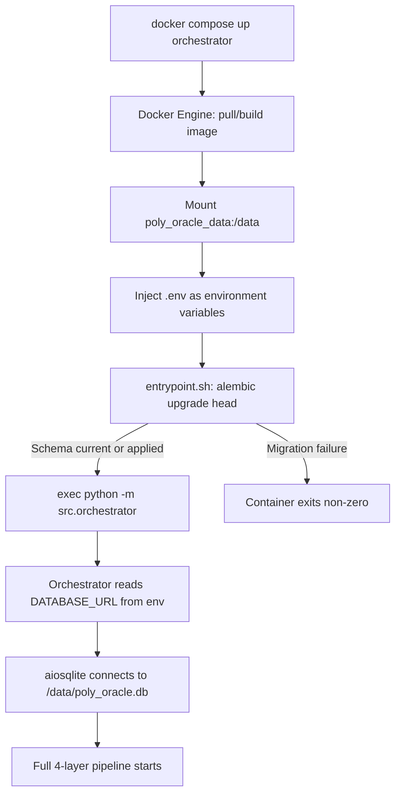
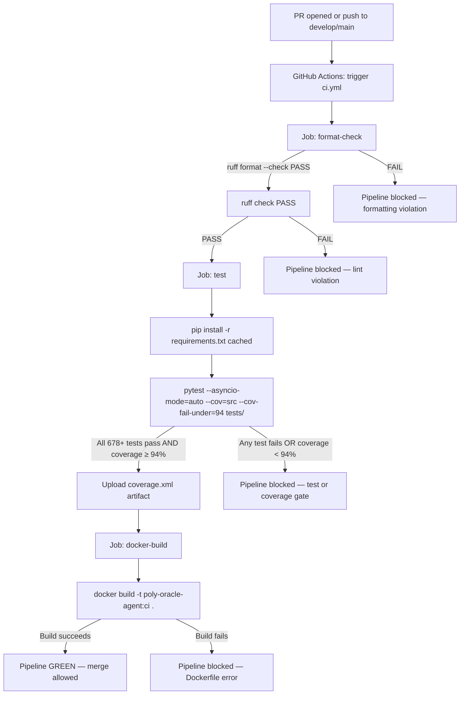
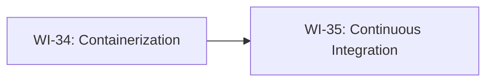

# PRD v11.0 - Poly-Oracle-Agent Phase 11

Source inputs: `docs/PRD-v10.0.md`, `STATE.md`, `docs/archive/ARCHIVE_PHASE_10.md`, `src/orchestrator.py`, `src/core/config.py`, `src/backtest_runner.py`, `src/db/engine.py`, `AGENTS.md`.

## 1. Executive Summary

Phase 10 delivered a production-grade, multi-market, economically-aware async trading engine. The system correctly evaluates markets, enforces portfolio risk limits, tracks positions, and validates strategies via offline backtesting. All logic is correct. None of it can be reliably deployed or maintained at scale without the two foundational DevOps pillars this phase installs.

Phase 11 shifts the system from "works on one machine" to "ships safely and repeatedly." It delivers two capabilities executed in strict dependency order:

1. **WI-34 — Containerization** wraps the Python engine in a reproducible, minimal Docker image using a multi-stage build strategy. The image exposes two distinct entry points — the live orchestrator and the offline backtester — and defines a volume-backed SQLite persistence strategy that survives container restarts. The build process never bakes secrets into the image layer. The resulting artifact is a self-contained unit that runs identically on any host with Docker installed.

2. **WI-35 — Continuous Integration** installs a GitHub Actions pipeline that runs on every pull request and push to `develop` and `main`. The pipeline enforces three sequential gates: formatting compliance (ruff), the full 678+ test suite (pytest), and a hard 94% coverage minimum that blocks merges when violated. No human review can override a failing coverage gate. The CI pipeline is the automated guardian of the invariants established across Phases 1–10.

Phase 11 introduces no changes to application logic, Pydantic schemas, SQLite models, or the four-layer evaluation pipeline. It is purely infrastructure and process — but it is the infrastructure that makes all prior work deployable and all future work safe to ship.

## 2. Core Pillars

### 2.1 Reproducible Execution Environment

The engine depends on a specific Python version, a precise set of packages, and environment variables that differ between development, test, and production. Containerization eliminates "works on my machine" failures by codifying the execution environment as a versioned artifact. Every deployment is identical to what was tested.

### 2.2 Minimal Attack Surface

The runtime container image must contain only what is needed to execute the application — no compilers, no test frameworks, no development tooling. A multi-stage build separates dependency installation (builder stage) from the final runtime image (runtime stage). Test files are excluded from the runtime image entirely.

### 2.3 Persistent State Across Container Lifecycles

SQLite is a file on disk. A container restart without a volume mount destroys all position data, migration state, and trade history. WI-34 defines a named volume mount at `/data/poly_oracle.db` and specifies how the `DATABASE_URL` environment variable is configured to point into the volume. An entrypoint script runs `alembic upgrade head` before starting the application, ensuring the schema is always current on a fresh volume mount.

### 2.4 Dual Entry Point Architecture

The backtester (`python -m src.backtest_runner`) and the live orchestrator (`python -m src.orchestrator`) are distinct execution modes that share the same source code and image but require different runtime behaviors. WI-34 defines both as first-class service definitions — each with its own CMD and volume configuration — so operators can run either without rebuilding the image.

### 2.5 Automated Quality Enforcement

Manual code review cannot reliably enforce coverage floors, detect formatting drift, or guarantee that all 678 tests pass on every PR. WI-35 removes the human single point of failure from quality gates. The CI pipeline runs identically on every contribution, in every branch, for every developer. A failing gate is a hard block — not a suggestion.

## 3. Work Items

### WI-34: Containerization

**Objective**
Produce a multi-stage `Dockerfile` and supporting files (`docker-compose.yml`, `.dockerignore`, `entrypoint.sh`) that containerize the poly-oracle-agent with minimal image size, zero secrets baked into image layers, a reproducible build process, persistent SQLite state via Docker volume, and two distinct service entry points for the live orchestrator and offline backtester.

**Scope Boundaries**

In scope:
- `Dockerfile` at the repository root — multi-stage build with a `builder` stage and a `runtime` stage
- `docker-compose.yml` at the repository root — defines `orchestrator` and `backtester` services
- `.dockerignore` at the repository root — excludes all non-essential paths from the build context
- `entrypoint.sh` at the repository root — shell script that runs `alembic upgrade head` then `exec "$@"`
- Named Docker volume `poly_oracle_data` — mounted at `/data` inside the container
- `DATABASE_URL` overridden to `sqlite+aiosqlite:////data/poly_oracle.db` at container runtime (not hardcoded in image)
- All secrets (`ANTHROPIC_API_KEY`, `POLYMARKET_PRIVATE_KEY`, `TELEGRAM_BOT_TOKEN`, etc.) sourced from an `.env` file passed to Docker via `--env-file` — never `COPY`-ed or `ARG`-ed into image layers
- Non-root user `appuser` (UID 1001) as the final image user — no container runs as root
- `HEALTHCHECK` instruction for the `orchestrator` service verifying the process is alive
- Python base image pinned to `python:3.12-slim-bookworm` (specific digest or tag — never `latest`)
- `requirements.txt` as the sole dependency source — installed in builder stage, copied to runtime

Out of scope:
- Kubernetes manifests, Helm charts, or orchestration beyond Docker Compose
- Multi-architecture builds (`linux/arm64`) — `linux/amd64` only for Phase 11
- Remote database backends (PostgreSQL migration, Supabase, etc.) — SQLite remains the backing store
- Image registry push automation — manual `docker push` or future CI job (deferred to Phase 12)
- Nginx reverse proxy, TLS termination, or any ingress configuration
- Secrets manager integration (AWS Secrets Manager, HashiCorp Vault) — `.env` file approach retained
- Any modification to `src/core/config.py`, `src/orchestrator.py`, `src/backtest_runner.py`, or any Python source file
- Docker layer caching via BuildKit secrets or cache mounts — standard `pip install` approach

**Multi-Stage Build Specification**

Stage 1 — `builder`:
- Base: `python:3.12-slim-bookworm`
- Working directory: `/build`
- Actions: install `requirements.txt` into a prefix directory (`/install`) using `pip install --no-cache-dir --prefix=/install -r requirements.txt`
- No source code copied in builder stage — only `requirements.txt`

Stage 2 — `runtime`:
- Base: `python:3.12-slim-bookworm` (same base — no distroless; distroless Python images lack the stdlib components required by `asyncio`, `sqlite3`, and `aiosqlite`)
- Working directory: `/app`
- Copies `/install` from builder stage into the system Python path
- Copies `src/`, `migrations/`, `alembic.ini`, `entrypoint.sh` into `/app`
- Does NOT copy: `tests/`, `.venv/`, `.git/`, `*.md` files, `docs/`, `.env`, `__pycache__/`
- Creates `/data` directory with `appuser:appuser` ownership for the SQLite volume mount point
- Creates non-root user: `RUN groupadd -r appuser && useradd -r -g appuser -u 1001 appuser`
- Sets `USER appuser`
- `ENTRYPOINT ["/app/entrypoint.sh"]` — always runs migration check before delegating to CMD
- `CMD ["python", "-m", "src.orchestrator"]` — default entry point is the live orchestrator
- `HEALTHCHECK`: interval 30s, timeout 10s, retries 3, command `python -c "import src.core.config; print('ok')"` (validates Python env is intact)

**Volume and Database Configuration**

| Aspect | Specification |
|---|---|
| Named volume | `poly_oracle_data` |
| Container mount point | `/data` |
| SQLite file path inside container | `/data/poly_oracle.db` |
| `DATABASE_URL` value in container | `sqlite+aiosqlite:////data/poly_oracle.db` |
| Alembic migration target | `head` — run by `entrypoint.sh` before `exec "$@"` |
| Volume ownership | `appuser:appuser` (UID 1001) |
| Backtester output directory | `/data/backtest_reports/` — mounted from same `poly_oracle_data` volume |

**Entrypoint Script Specification (`entrypoint.sh`)**

The script must:
1. Run `alembic upgrade head` — exits non-zero on failure, stopping container startup
2. On success, `exec "$@"` — replaces shell with the CMD process (PID 1 hand-off for signal propagation)
3. Be marked executable (`chmod +x`) in the `Dockerfile` via `RUN chmod +x /app/entrypoint.sh`
4. Contain no hardcoded paths that differ between orchestrator and backtester execution modes

**Docker Compose Service Specification**

`orchestrator` service:
- `build: .` (uses root `Dockerfile`)
- `image: poly-oracle-agent:latest`
- `command: python -m src.orchestrator` (overrides CMD)
- `env_file: .env` — all secrets injected at runtime
- `environment: DATABASE_URL=sqlite+aiosqlite:////data/poly_oracle.db` — overrides any `.env` value for DATABASE_URL
- `volumes: poly_oracle_data:/data`
- `restart: unless-stopped`
- Health check mirrors Dockerfile HEALTHCHECK

`backtester` service:
- `build: .` (same image)
- `command: python -m src.backtest_runner --data-dir /data/historical --output /data/backtest_reports/report.json`
- `env_file: .env`
- `environment: DATABASE_URL=sqlite+aiosqlite:////data/poly_oracle.db`
- `volumes: poly_oracle_data:/data` — shares same volume; backtester reads historical data and writes reports into `/data`
- `profiles: [backtester]` — not started by default `docker compose up`

Volume declaration:
- `poly_oracle_data: driver: local`

**.dockerignore Specification**

Must exclude all of the following from the build context sent to the Docker daemon:
- `.git/` and `.gitignore`
- `.venv/` and `venv/`
- `tests/`
- `__pycache__/` and `**/*.pyc` and `**/*.pyo`
- `.env` and `.env.*`
- `*.md` (documentation)
- `docs/`
- `.github/`
- `*.db` (local SQLite databases — must not be baked into image)
- `*.db-shm`, `*.db-wal` (SQLite WAL files)
- `dist/`, `build/`, `*.egg-info/`
- `.ruff_cache/`, `.mypy_cache/`, `.pytest_cache/`
- `htmlcov/`, `coverage.xml`, `.coverage`

**Data Flow — Container Startup Sequence**



**Key Invariants Enforced**

1. No secret value (`ANTHROPIC_API_KEY`, `POLYMARKET_PRIVATE_KEY`, `TELEGRAM_BOT_TOKEN`) appears in any `Dockerfile` instruction (`RUN`, `ENV`, `ARG`, `COPY`). All secrets arrive exclusively via `--env-file` at `docker run` / `docker compose up` time.
2. The `tests/` directory is excluded from the runtime image. The runtime image contains no test code.
3. The application runs as non-root `appuser` (UID 1001). No `USER root` instruction appears after the `appuser` declaration in the runtime stage.
4. `alembic upgrade head` runs before the application process starts. If the migration fails, the container fails fast — it does not start with a stale or missing schema.
5. The same Docker image serves both orchestrator and backtester. No second `Dockerfile` is created.
6. `DATABASE_URL` is not hardcoded in the image. It is always injected at runtime via environment variable.
7. The builder stage produces no artifacts in the final runtime image other than the installed Python packages under `/install`.
8. The `python:3.12-slim-bookworm` tag is pinned. `latest` or `3.12` (floating) tags are prohibited.

**Components Delivered**

| Component | Location |
|---|---|
| `Dockerfile` | `/Dockerfile` (repository root) |
| `docker-compose.yml` | `/docker-compose.yml` (repository root) |
| `.dockerignore` | `/.dockerignore` (repository root) |
| `entrypoint.sh` | `/entrypoint.sh` (repository root) |

**Acceptance Criteria**

1. `docker build -t poly-oracle-agent:latest .` completes without error from a clean build context.
2. Built image size is under 800MB (slim base + dependencies — no compiler toolchain in final layer).
3. `docker run --env-file .env -e DATABASE_URL=sqlite+aiosqlite:////data/poly_oracle.db -v poly_oracle_data:/data poly-oracle-agent:latest` starts the orchestrator, runs `alembic upgrade head`, and begins the main event loop.
4. `docker compose run backtester` runs `src.backtest_runner` with the correct CLI flags against `/data/historical`.
5. Stopping and restarting the `orchestrator` service preserves all position data — no rows lost — confirming volume persistence.
6. `docker inspect poly-oracle-agent:latest` shows `User: appuser` — container does not run as root.
7. `docker history poly-oracle-agent:latest` contains no layer with any secret value — no `ANTHROPIC_API_KEY`, `POLYMARKET_PRIVATE_KEY`, or similar.
8. `.dockerignore` causes `tests/` and `.venv/` to be absent from the image (verified via `docker run ... ls /app/tests` returning non-zero exit).
9. `entrypoint.sh` runs `alembic upgrade head` and propagates a non-zero exit if migration fails, causing the container to halt before the application starts.
10. `docker compose up orchestrator` starts the service with `restart: unless-stopped` behavior.
11. The `backtester` service is not started by `docker compose up` (requires `--profile backtester`).
12. No Python source files were modified to implement WI-34.

---

### WI-35: Continuous Integration

**Objective**
Implement a GitHub Actions workflow at `.github/workflows/ci.yml` that automatically runs on every pull request and push to `develop` and `main`. The pipeline enforces three sequential, blocking gates: formatting compliance checked by `ruff`, the full test suite executed by `pytest`, and a hard 94% coverage minimum enforced via `--cov-fail-under`. A failing coverage gate blocks merge — it cannot be overridden by approval alone. Branch protection rules must be configured in GitHub repository settings to require all three CI jobs to pass before a PR can be merged.

**Scope Boundaries**

In scope:
- `.github/workflows/ci.yml` — single workflow file; all three jobs defined within it
- Trigger: `pull_request` targeting `develop` or `main`; `push` to `develop` or `main`
- Job 1 — `format-check`: runs `ruff format --check .` and `ruff check .`; fails the job on any formatting or lint violation
- Job 2 — `test`: runs `pytest --asyncio-mode=auto --cov=src --cov-report=xml --cov-fail-under=94 tests/` in the project virtualenv; fails the job if any test fails or coverage drops below 94%
- Job 3 — `docker-build`: runs `docker build -t poly-oracle-agent:ci .`; validates the `Dockerfile` (WI-34) builds successfully on CI infrastructure; fails on any build error
- Python version pinned to `3.12` using `actions/setup-python@v5`
- Dependency caching: `pip` cache keyed on `requirements.txt` hash using `actions/cache@v4` to avoid full reinstall on every run
- Coverage report (`coverage.xml`) uploaded as a workflow artifact using `actions/upload-artifact@v4` — retained for 7 days
- `pytest` exit code is the authoritative gate signal — non-zero exit from `--cov-fail-under` fails the job
- Job dependency: `test` depends on `format-check` (`needs: format-check`); `docker-build` depends on `test` (`needs: test`) — pipeline is strictly sequential, no parallelism
- Ubuntu runner: `ubuntu-latest` (standard GitHub-hosted runner) for all three jobs

Out of scope:
- macOS or Windows runner matrix — `ubuntu-latest` only for Phase 11
- Python version matrix (3.11, 3.13) — `3.12` only
- Deployment steps, `docker push`, or image registry interaction — deferred to Phase 12
- Slack or Telegram notifications on CI failure — deferred to Phase 12
- Security scanning (Trivy, Snyk, `pip-audit`) — deferred to Phase 12
- Performance regression tests or benchmark CI jobs
- Dependabot configuration or automated dependency updates
- Code coverage service integration (Codecov, Coveralls) — local artifact upload only
- Any modification to `pytest.ini`, `pyproject.toml`, `setup.cfg`, or test files

**Workflow Trigger Specification**

```
on:
  pull_request:
    branches: [develop, main]
  push:
    branches: [develop, main]
```

The workflow fires on all four trigger combinations: PR to `develop`, PR to `main`, direct push to `develop`, direct push to `main`. It does NOT fire on feature branches unless a PR is opened targeting `develop` or `main`.

**Job 1 — `format-check` Specification**

| Parameter | Value |
|---|---|
| Runner | `ubuntu-latest` |
| Python version | `3.12` |
| Checkout | `actions/checkout@v4` |
| Install deps | `pip install ruff` (only ruff — no full requirements needed for format check) |
| Step 1 | `ruff format --check .` — exits non-zero if any file would be reformatted |
| Step 2 | `ruff check .` — exits non-zero on any lint rule violation |
| Failure behavior | Entire job fails; downstream jobs (`test`, `docker-build`) do not run |
| Cache | Not needed — ruff install is fast (<2s) |

**Job 2 — `test` Specification**

| Parameter | Value |
|---|---|
| Runner | `ubuntu-latest` |
| Python version | `3.12` |
| Depends on | `format-check` |
| Checkout | `actions/checkout@v4` |
| Cache key | `pip-${{ hashFiles('requirements.txt') }}` via `actions/cache@v4` |
| Cache path | `~/.cache/pip` |
| Install command | `pip install -r requirements.txt` |
| Test command | `pytest --asyncio-mode=auto --cov=src --cov-report=xml --cov-fail-under=94 tests/` |
| Coverage XML path | `coverage.xml` in workspace root |
| Artifact upload | `actions/upload-artifact@v4`, name `coverage-report`, path `coverage.xml`, retention 7 days |
| Failure behavior | Job fails if any test fails OR if `--cov-fail-under=94` threshold is not met |
| Test count expectation | Pipeline executes all 678+ tests — new tests added in Phase 11 will extend this baseline |

The `--cov-fail-under=94` flag is the **hard blocking gate**. If the measured coverage drops below 94% — whether due to new untested code, deleted tests, or coverage exclusion misconfiguration — `pytest` exits non-zero, the job fails, and the PR cannot be merged.

**Job 3 — `docker-build` Specification**

| Parameter | Value |
|---|---|
| Runner | `ubuntu-latest` |
| Depends on | `test` |
| Checkout | `actions/checkout@v4` |
| Docker setup | `docker/setup-buildx-action@v3` |
| Build command | `docker build -t poly-oracle-agent:ci .` |
| No push | Image is built locally on the runner; not pushed to any registry |
| Cache | Docker layer cache via BuildKit cache-from/cache-to using GitHub Actions cache backend |
| Failure behavior | Job fails if `docker build` exits non-zero |

**Branch Protection Rules (GitHub Settings — not automated)**

The following GitHub branch protection rules MUST be configured manually in repository settings after WI-35 is merged. These rules are not part of the workflow YAML but are required for CI to function as a hard merge gate:

For `develop`:
- Require status checks to pass before merging: `format-check`, `test`, `docker-build`
- Require branches to be up to date before merging: enabled
- Include administrators: enabled (no bypass)

For `main`:
- All rules from `develop` plus:
- Require pull request reviews before merging: 1 approving review
- Restrict who can push to matching branches: restrict to CI service account or maintainer list

**Data Flow — CI Pipeline Execution**



**Key Invariants Enforced**

1. The 94% coverage floor is enforced by `--cov-fail-under=94` — not by a separate coverage service or manual inspection. `pytest` exit code is the gate signal.
2. `format-check` runs before `test`. A formatting violation blocks the expensive test run, saving CI minutes.
3. `docker-build` runs only after tests pass. A broken `Dockerfile` does not consume CI time on a branch with failing tests.
4. No job uses `continue-on-error: true`. A failing step fails the job. A failing job blocks the pipeline.
5. The pipeline runs on `ubuntu-latest`. No macOS or self-hosted runners are used in Phase 11.
6. `requirements.txt` is the single source of truth for CI dependencies — no separate `requirements-dev.txt` or `requirements-ci.txt` for the test job.
7. The `ANTHROPIC_API_KEY` and all other production secrets are NEVER added to GitHub Actions secrets for the test job. All tests that require the Claude API must use mocks (`dry_run=True` + monkeypatched responses). A CI run that requires a live API key is a test isolation violation.
8. The coverage gate covers `src/` — the `--cov=src` flag ensures test utility files and `migrations/` are excluded from coverage measurement.
9. The workflow YAML is stored at `.github/workflows/ci.yml` — no other workflow files are created in Phase 11.
10. Job names (`format-check`, `test`, `docker-build`) are stable identifiers — they are the exact strings that must be entered into GitHub branch protection status check requirements.

**Components Delivered**

| Component | Location |
|---|---|
| `ci.yml` workflow | `.github/workflows/ci.yml` |

**Acceptance Criteria**

1. `.github/workflows/ci.yml` exists and is valid YAML parseable by GitHub Actions.
2. Workflow triggers fire on `pull_request` to `develop` and `main`, and on `push` to `develop` and `main`.
3. `format-check` job runs `ruff format --check .` and `ruff check .`; both must exit zero for the job to pass.
4. `test` job runs after `format-check` succeeds (`needs: format-check`).
5. `test` job installs from `requirements.txt` with pip cache keyed on `hashFiles('requirements.txt')`.
6. `test` job command is exactly: `pytest --asyncio-mode=auto --cov=src --cov-report=xml --cov-fail-under=94 tests/`
7. `coverage.xml` is uploaded as a workflow artifact with 7-day retention.
8. A PR that causes coverage to drop below 94% results in a failed `test` job and a blocked PR.
9. `docker-build` job runs after `test` succeeds (`needs: test`).
10. `docker-build` job builds the image from the root `Dockerfile` via `docker build -t poly-oracle-agent:ci .`.
11. A broken `Dockerfile` fails the `docker-build` job and blocks the pipeline.
12. No production secrets appear in the workflow YAML or in GitHub Actions secrets configuration.
13. All three job names (`format-check`, `test`, `docker-build`) are configured as required status checks in GitHub branch protection for both `develop` and `main`.
14. A PR where all three jobs pass is unblocked for merge — no additional CI approval required beyond the branch protection review requirement on `main`.
15. No Python source files, test files, or configuration files in `src/`, `tests/`, or `migrations/` are modified to implement WI-35.

---

## 4. Dependency Order & Execution Plan

Phase 11 work items must be executed in strict dependency order:



**Execution Order:**
1. **WI-34** (Containerization) — must be completed first. The `docker-build` job in WI-35 CI validates that the `Dockerfile` builds successfully. CI cannot be written and validated until the `Dockerfile` exists.
2. **WI-35** (Continuous Integration) — implemented after WI-34. The first run of the CI pipeline validates WI-34's `docker-build` job against the actual `Dockerfile`.

**Rationale:** WI-35's `docker-build` job is a direct quality gate on WI-34's output. Implementing them in reverse order would require writing the CI job against a non-existent `Dockerfile`, producing a permanently failing pipeline until WI-34 is merged.

## 5. Architecture Snapshot After Phase 11

The four-layer pipeline is unchanged. Phase 11 adds one new execution boundary (the container) and one new quality enforcement layer (CI), neither of which alters application logic.

```text
Infrastructure Layer (Phase 11):
  Docker Container (python:3.12-slim-bookworm, appuser, non-root)
    |-- Volume: poly_oracle_data:/data (SQLite + backtest reports)
    |-- Entry Point: entrypoint.sh (alembic upgrade head -> exec CMD)
    |-- Service 1: python -m src.orchestrator  (default)
    |-- Service 2: python -m src.backtest_runner (profile: backtester)

Application Layer (Phase 10, unchanged):
  Layer 1: Ingestion
    CLOBWebSocketClient (multiplexed subscribe_batch)
    + GammaRESTClient + MarketDiscoveryEngine

  Layer 2: Context
    DataAggregator (concurrent via asyncio.gather)
    + PromptFactory

  Layer 3: Evaluation
    ClaudeClient + LLMEvaluationResponse Gatekeeper

  Layer 4: Execution
    Entry Path:
      GasEstimator -> ExposureValidator -> WalletBalanceProvider
      -> CircuitBreaker -> ExecutionRouter -> PositionTracker
      -> TransactionSigner -> NonceManager -> OrderBroadcaster

    Exit Path:
      ExitStrategyEngine -> ExitOrderRouter
      -> PnLCalculator -> OrderBroadcaster

    Analytics / Telemetry Path:
      PortfolioAggregator -> PositionLifecycleReporter -> AlertEngine
      -> CircuitBreaker.evaluate_alerts() -> TelegramNotifier
      -> RiskMetricsEngine

  Offline Path:
    BacktestRunner (historical JSON -> full pipeline -> BacktestReport)

CI Quality Layer (Phase 11):
  GitHub Actions: ci.yml
    |-- format-check: ruff format --check + ruff check
    |-- test: pytest 678+ tests, --cov-fail-under=94
    |-- docker-build: docker build validates Dockerfile
```

No new queues, schemas, repositories, or database tables are introduced in Phase 11.

## 6. Config Changes Summary (Phase 11)

Phase 11 introduces **no new `AppConfig` fields**. All configuration changes are at the infrastructure level (Docker environment variables and GitHub Actions YAML).

| Config Surface | Change | Mechanism |
|---|---|---|
| `DATABASE_URL` | Overridden to `sqlite+aiosqlite:////data/poly_oracle.db` in container | Docker environment variable via `docker-compose.yml` |
| All secrets | Injected at runtime, never baked | `--env-file .env` passed to `docker run` / `docker compose up` |
| Python version | Pinned to `3.12` in CI | `actions/setup-python@v5` with `python-version: '3.12'` |
| Coverage floor | 94% enforced in CI | `--cov-fail-under=94` in `pytest` command |

## 7. MAAP Audit Checklist (Phase 11)

Before any `git commit` on Phase 11 core logic:

### Secret Hygiene
- [ ] WI-34: `Dockerfile` contains no `ENV`, `ARG`, or `RUN` instruction with any secret value
- [ ] WI-34: `.env` is listed in `.dockerignore` — local env file cannot be `COPY`-ed into image
- [ ] WI-34: `docker history poly-oracle-agent:latest` reveals no secret in any layer
- [ ] WI-35: No production secrets in `.github/workflows/ci.yml` or GitHub Actions secrets for the `test` job

### Non-Root Execution
- [ ] WI-34: `USER appuser` (UID 1001) declared in runtime stage
- [ ] WI-34: No `USER root` appears after the `appuser` declaration
- [ ] WI-34: `/data` directory is owned by `appuser:appuser` before `USER appuser` is set

### Volume Persistence
- [ ] WI-34: `DATABASE_URL=sqlite+aiosqlite:////data/poly_oracle.db` in `docker-compose.yml` environment block
- [ ] WI-34: Named volume `poly_oracle_data` declared in `docker-compose.yml` volumes section
- [ ] WI-34: `entrypoint.sh` runs `alembic upgrade head` and exits non-zero on failure before starting the application

### Test Isolation in CI
- [ ] WI-35: All 678+ tests pass without live API keys (`ANTHROPIC_API_KEY` not in CI environment)
- [ ] WI-35: `--cov-fail-under=94` is present in the `pytest` command — not a separate coverage check step
- [ ] WI-35: `--cov=src` scopes coverage to `src/` only — `tests/` and `migrations/` are excluded

### Build Context Hygiene
- [ ] WI-34: `tests/` is present in `.dockerignore` — excluded from build context
- [ ] WI-34: `.venv/` is present in `.dockerignore`
- [ ] WI-34: `*.db` is present in `.dockerignore` — no local SQLite database baked into image
- [ ] WI-34: `docker build` is verified against a clean build context (no `.venv/` or `__pycache__/` noise)

### Application Invariants Preserved
- [ ] WI-34: Zero modifications to any file in `src/`, `tests/`, or `migrations/`
- [ ] WI-35: Zero modifications to any file in `src/`, `tests/`, or `migrations/`
- [ ] WI-34 + WI-35: `LLMEvaluationResponse` Gatekeeper authority unchanged
- [ ] WI-34 + WI-35: Decimal math invariants unchanged — Phase 11 cannot introduce float regressions

### CI Pipeline Correctness
- [ ] WI-35: `format-check` → `test` → `docker-build` sequential dependency is explicit in YAML (`needs:` fields)
- [ ] WI-35: No job uses `continue-on-error: true`
- [ ] WI-35: Job names exactly match branch protection required status check strings
- [ ] WI-35: Pip cache key is `hashFiles('requirements.txt')` — cache invalidated on dependency changes

## 8. Phase 11 Completion Gate

Phase 11 is complete when ALL of the following are true:

1. WI-34 implemented: `Dockerfile`, `docker-compose.yml`, `.dockerignore`, and `entrypoint.sh` pass all acceptance criteria
2. WI-35 implemented: `.github/workflows/ci.yml` passes all acceptance criteria
3. `docker build -t poly-oracle-agent:latest .` completes successfully from a clean context
4. `docker compose up orchestrator` starts the engine with persistent SQLite state confirmed across two restart cycles
5. GitHub Actions CI pipeline runs green on a test PR: all three jobs (`format-check`, `test`, `docker-build`) pass
6. 94% coverage gate is confirmed blocking: a synthetic test-deletion branch demonstrates the gate fails below threshold
7. Branch protection rules are configured in GitHub for both `develop` and `main` requiring all three CI status checks
8. Full regression remains green: `pytest --asyncio-mode=auto tests/` passes locally (678+ tests, 94% coverage)
9. No `AppConfig` fields were added or modified
10. No files in `src/`, `tests/`, or `migrations/` were modified
11. `STATE.md` updated: version `0.11.0`, status `Phase 11 Complete`
12. `docs/archive/ARCHIVE_PHASE_11.md` created
13. PR from `develop` → `main` merged with CI green
