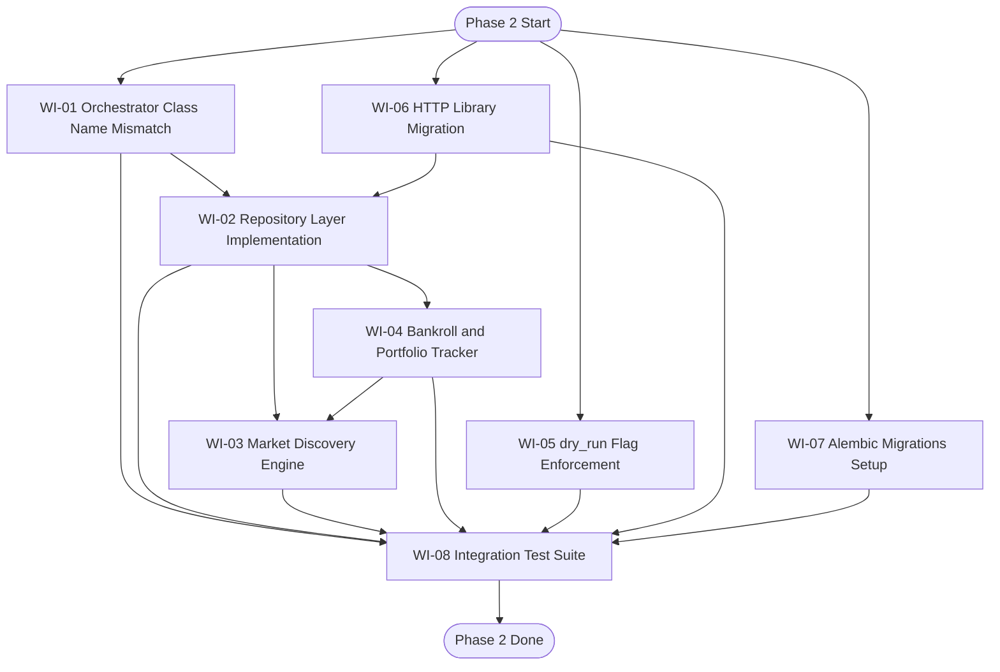

# PRD v2.0 - poly-oracle-agent Phase 2

_Source of truth: `STATE.md` (Last Updated: 2026-03-22)._

## 1. Executive Summary

Phase 2 converts poly-oracle-agent from a component-complete prototype into a production-ready trading service for Polymarket. Phase 1 delivered the core async pipeline, data validation, persistence models, and execution primitives, but the system is not operational because the orchestrator cannot start, persistence abstractions are stubbed, market selection is hardcoded, bankroll and exposure are not tracked, `dry_run` is not enforced, migrations are not configured, and integration tests are missing.

Phase 2 delivers eight concrete outcomes: fix the orchestrator blocker, implement the repository layer, add market discovery, add bankroll and portfolio tracking, enforce `dry_run`, standardize the REST stack on `httpx`, configure Alembic migrations, and prove the full pipeline with integration tests. These items matter because they move the agent from isolated component correctness to safe, repeatable, end-to-end operation.

For this system, **production-ready** means all of the following are true:

- The process starts and stops cleanly with the real class graph and no import-time failures.
- Markets are selected dynamically from live metadata; no hardcoded bankroll or hardcoded `condition_id` remains in runtime code.
- Position sizing uses tracked capital and current exposure, not defaults.
- `dry_run` prevents all external trading side effects while preserving upstream evaluation behavior.
- Persistence is accessed through implemented repositories and managed through Alembic migrations.
- End-to-end integration tests pass, and project coverage is at least 80%.
- README-based operator onboarding is sufficient to install, configure, migrate, run, and test the system without reading source code first.

## 2. Phase 1 Completion Audit

### What Phase 1 built

Phase 1 completed the core infrastructure and the four-layer async pipeline:

- **Layer 1 - Ingestion:** `CLOBWebSocketClient` streams Polymarket CLOB data, validates frames, persists snapshots, and reconnects with exponential backoff. `GammaRESTClient` fetches market metadata with caching and graceful stale-cache fallback.
- **Layer 2 - Context:** `DataAggregator` maintains orderbook state and emits on time and volatility triggers. `PromptFactory` constructs structured Chain-of-Thought prompts with an embedded JSON schema.
- **Layer 3 - Evaluation:** `ClaudeClient` calls Anthropic Claude asynchronously, retries on schema-validation failures, validates output through `LLMEvaluationResponse`, persists the full audit trail, and routes approved trades downstream.
- **Layer 4 - Execution:** `TransactionSigner`, `NonceManager`, `GasEstimator`, and `OrderBroadcaster` implement EIP-712 signing, async-safe nonce handling, EIP-1559 gas estimation, CLOB submission, receipt polling, and transaction persistence.
- **Schemas and DB:** Pydantic V2 schemas are implemented for market, LLM, and web3 domains. SQLAlchemy async engine and three normalized tables are implemented.
- **Core platform:** Typed config loading, structured logging, custom exception hierarchy, scripts, and architecture/risk/business documentation are in place.

### Verified working

The following are verified as implemented and working at the component level based on the state document:

- The ingestion layer is implemented and directly unit-tested (`test_ingestion.py`, 7 tests).
- The execution primitives are implemented and directly unit-tested:
  - `NonceManager` (`test_nonce_manager.py`, 7 tests)
  - `TransactionSigner` (`test_signer.py`, 7 tests)
  - `GasEstimator` (`test_gas_estimator.py`, 6 tests)
  - `OrderBroadcaster` (`test_broadcaster.py`, 8 tests)
- The database tables exist, and the SQLite database file has already been created.
- Configuration, logging, and the documented risk model are implemented.
- Total implemented tests are approximately 35, all under `pytest` and `pytest-asyncio`.

The state summary describes the major components as working in isolation, but the direct automated evidence is concentrated in ingestion and execution; schema, prompt, and integration test files are still empty.

### Implemented but not fully verified

The following are implemented but not sufficiently validated for production use:

- `PromptFactory` has an implementation, but `tests/unit/test_prompt_factory.py` is empty.
- Schema-level gatekeeper behavior is implemented, but `tests/unit/test_schemas.py` is empty.
- `ClaudeClient` is implemented, but `tests/integration/test_claude_client.py` is empty.
- WebSocket integration behavior is implemented, but `tests/integration/test_ws_client.py` is empty.
- The overall queue-wired pipeline is not verified end-to-end.

### Broken or incomplete

The following are confirmed gaps that block or materially weaken production readiness:

- `src/orchestrator.py` references legacy class names and will crash on import.
- All three DB repository files are stubs.
- Market selection is not autonomous; the orchestrator uses a hardcoded Polymarket asset.
- Order sizing uses a default 1000 USDC bankroll, and there is no portfolio or exposure tracking.
- `dry_run` exists in config but is not enforced in execution code.
- `rest_client.py` uses `aiohttp` while the project declares `httpx`.
- Alembic migrations are not configured.
- Integration tests are missing.
- `README.md` is empty.

## 3. Phase 2 Scope - 8 Work Items

### WI-01: Orchestrator Class Name Mismatch (BLOCKER)

**Problem:**  
`src/orchestrator.py` references legacy class names (`AsyncWebSocketClient`, `TxBroadcaster`) instead of the implemented classes (`CLOBWebSocketClient`, `OrderBroadcaster`). The state document explicitly says the orchestrator will crash on import.

**Impact:**  
The system cannot start its event loop, cannot wire the four pipeline queues, and cannot support any end-to-end validation. This blocks every Phase 2 activity that depends on a runnable process.

**Acceptance Criteria:**

1. `src/orchestrator.py` imports and instantiates the implemented runtime classes only; no references to `AsyncWebSocketClient` or `TxBroadcaster` remain in the runtime codebase.
2. A startup smoke test instantiates the orchestrator, creates the three queues, and reaches task creation without `ImportError`, `NameError`, or `AttributeError`.
3. A shutdown smoke test proves the orchestrator still calls `.stop()` on all managed components and disposes the async database engine without hanging.

**Dependencies:**  
None.

**Risk Level:**  
HIGH

---

### WI-02: Repository Layer Implementation

**Problem:**  
`src/db/repositories/market_repo.py`, `decision_repo.py`, and `execution_repo.py` are empty. Runtime code therefore relies on direct session usage instead of a stable persistence abstraction.

**Impact:**  
Phase 2 features cannot safely query or update state through a consistent API. Persistence logic remains duplicated and hard to test. Bankroll tracking, portfolio exposure checks, and market discovery will be coupled directly to ORM/session details if this is not resolved.

**Acceptance Criteria:**

1. The three repository modules contain async repository implementations for `market_snapshots`, `agent_decision_logs`, and `execution_txs`.
2. Repository methods cover the Phase 2 read/write paths at minimum:
   - snapshot insert and latest snapshot lookup by `condition_id`
   - decision insert and recent decision lookup by market/time window
   - execution insert/update and lookup by `decision_id`, status, and market
   - aggregate exposure queries required by WI-04 and WI-03
3. Runtime code outside `src/db/` does not issue ad hoc SQLAlchemy queries for these domains; it uses repository methods instead.
4. Repository unit tests run against an async SQLite test database and verify commit, rollback, and query correctness.

**Dependencies:**  
WI-01, WI-06

**Risk Level:**  
HIGH

---

### WI-03: Market Discovery Engine

**Problem:**  
The agent has no mechanism to discover and select markets autonomously. The orchestrator currently uses a single hardcoded Polymarket condition ID.

**Impact:**  
The system is not an autonomous trading agent in operational terms. It can only run against a test market, cannot rotate into eligible opportunities, and fails the Phase 2 requirement to eliminate hardcoded market selection.

**Acceptance Criteria:**

1. A market discovery component uses `GammaRESTClient.get_active_markets()` to build a candidate market list without any hardcoded `condition_id`.
2. Candidate selection applies objective eligibility filters using available system data, at minimum:
   - active and non-closed market status
   - presence of required trading metadata (`condition_id` and token identifiers)
   - `hours_to_resolution >= MIN_TTR_HOURS`
   - exclusion of markets already at or above exposure limits from WI-04
3. The orchestrator consumes discovery output and subscribes the ingestion layer to discovered markets rather than to a fixed asset ID.
4. If no market is eligible, the system logs the condition and does not silently fall back to a hardcoded market.
5. Tests verify that eligible markets are selected from mocked Gamma data and that ineligible markets are excluded deterministically.

**Dependencies:**  
WI-02, WI-04

**Risk Level:**  
HIGH

---

### WI-04: Bankroll & Portfolio Tracker

**Problem:**  
`build_order_from_decision()` uses a default 1000 USDC bankroll, and the system has no awareness of existing positions or aggregate exposure.

**Impact:**  
Position sizing is disconnected from real capital. The gatekeeper's 3% exposure cap is not meaningful in practice, and the system can over-allocate capital or repeatedly add exposure to the same market without awareness.

**Acceptance Criteria:**

1. Order sizing no longer uses a hardcoded 1000 USDC bankroll anywhere in runtime code.
2. A bankroll/portfolio service computes available bankroll and current exposure from persisted system state before order creation.
3. Exposure calculations include at least pending and confirmed execution records and are queryable by market and outcome.
4. If a proposed trade would exceed available bankroll or configured exposure limits, the trade is rejected before signing or broadcasting.
5. A restart/recovery test proves the tracker can reconstruct bankroll and exposure state from the database with the same results after process restart.
6. Unit tests verify sizing from tracked bankroll, exposure aggregation, insufficient-bankroll rejection, and overexposure rejection.

**Dependencies:**  
WI-02

**Risk Level:**  
HIGH

---

### WI-05: dry_run Flag Enforcement

**Problem:**  
`DRY_RUN` is present in `AppConfig` but is not checked in execution code.

**Impact:**  
A user can configure `dry_run=True` and still trigger real signing, nonce consumption, order submission, or receipt polling. This is a direct operational safety failure.

**Acceptance Criteria:**

1. When `DRY_RUN=true`, the execution path does not call `TransactionSigner.sign_order()`, `NonceManager.get_next_nonce()`, CLOB order submission, or Polygon receipt polling.
2. When `DRY_RUN=true`, upstream ingestion, context building, evaluation, and decision persistence continue to run normally.
3. Each prevented execution emits a structured log entry containing `dry_run=true`, `condition_id`, proposed action, and would-be order sizing data.
4. An integration test verifies that an approved trade in dry-run mode produces zero external execution side effects and does not advance nonce state.

**Dependencies:**  
None.

**Risk Level:**  
HIGH

---

### WI-06: HTTP Library Migration (aiohttp -> httpx)

**Problem:**  
`rest_client.py` uses `aiohttp` even though the project dependency manifest declares `httpx` as the async HTTP client.

**Impact:**  
The runtime dependency graph is inconsistent. Installation can fail if `aiohttp` is absent, behavior diverges across HTTP clients, and testing/observability patterns are split unnecessarily.

**Acceptance Criteria:**

1. `src/agents/ingestion/rest_client.py` uses `httpx.AsyncClient` exclusively; no `aiohttp` import remains in that module.
2. Existing behavior is preserved:
   - `get_active_markets()` still returns active, non-closed markets
   - `get_market_by_condition_id()` keeps its not-found handling contract
   - the 60-second cache TTL remains in place
   - stale cache is returned on API failure
   - 5xx responses still raise `RESTClientError`
3. Unit tests verify behavior parity under `httpx`-based mocks.
4. The project has a single supported async HTTP client for the REST layer.

**Dependencies:**  
None.

**Risk Level:**  
MEDIUM

---

### WI-07: Alembic Migrations Setup

**Problem:**  
`migrations/env.py` is empty, `migrations/versions/` has no revisions, and schema creation currently relies on `Base.metadata.create_all()`.

**Impact:**  
Schema evolution is unmanaged. There is no versioned upgrade path for deployments, no reliable downgrade path for test environments, and no controlled way to carry Phase 2 persistence changes forward.

**Acceptance Criteria:**

1. Alembic is configured against the project's SQLAlchemy metadata and can run in the project environment.
2. An initial baseline migration exists for the current three-table schema.
3. Running `alembic upgrade head` against an empty database produces the expected schema successfully.
4. A migration smoke test performs upgrade, downgrade, and re-upgrade successfully in a test environment.
5. Managed environment setup documentation and scripts use Alembic migrations instead of raw `create_all()` for primary database initialization.

**Dependencies:**  
None.

**Risk Level:**  
MEDIUM

---

### WI-08: Integration Test Suite

**Problem:**  
Integration coverage is missing. `tests/conftest.py` is empty, and the integration test files for WebSocket and Claude are empty.

**Impact:**  
The project has no end-to-end proof that queue wiring, persistence, discovery, `dry_run`, and external-client boundaries work together. Regression risk remains high even if all unit tests pass.

**Acceptance Criteria:**

1. `tests/conftest.py` provides shared async fixtures for:
   - isolated test database setup
   - config overrides
   - mocked external services (Gamma, Anthropic, CLOB, Polygon RPC)
   - queue and orchestrator bootstrapping
2. Integration tests cover, at minimum:
   - orchestrator startup and graceful shutdown
   - ingestion -> context -> evaluation queue handoff
   - approved trade flow in `dry_run` mode with zero external side effects
   - market discovery replacing the hardcoded market ID
   - repository-backed persistence assertions across all three tables
3. The integration suite runs without live network access and passes deterministically with a single test command.
4. Coverage reporting shows total project coverage of at least 80%.

**Dependencies:**  
WI-01, WI-02, WI-03, WI-04, WI-05, WI-06, WI-07

**Risk Level:**  
HIGH

## 4. Phase 2 Execution Order

### Dependency graph

### Recommended build sequence with rationale

1. **WI-01, WI-05, WI-06 in parallel first.**  
   WI-01 removes the hard startup blocker. WI-05 closes the highest-risk operational safety gap. WI-06 standardizes the REST client before repository work begins.

2. **WI-02 next.**  
   Once startup and HTTP dependencies are corrected, implement repositories so all subsequent features build on a stable persistence API instead of direct session queries.

3. **WI-04 after WI-02.**  
   Bankroll and portfolio tracking need repository-backed reads across decisions and executions. This work removes the hardcoded bankroll and provides the exposure state required by discovery.

4. **WI-03 after WI-02 and WI-04.**  
   Discovery must use repository-backed historical state and live bankroll/exposure constraints. Implementing it earlier would force rework or leave hardcoded safeguards in place.

5. **WI-07 after feature-affecting persistence work stabilizes.**  
   Alembic can start earlier, but it is most efficient after repository-backed and portfolio-related persistence requirements are finalized, so the baseline and follow-on revisions are not churned repeatedly.

6. **WI-08 last.**  
   Integration tests should validate the final runtime shape, not an intermediate one. Running them after the other work items minimizes test churn and gives a clean release gate.

7. **Release closeout after WI-08.**  
   Finish `README.md`, verify coverage, and perform a final scan for hardcoded bankroll and `condition_id` values before declaring Phase 2 complete.

## 5. Definition of Done (Phase 2)

Phase 2 is complete only when all of the following are true:

1. End-to-end integration tests pass for the queue-wired pipeline.
2. `dry_run` mode is fully enforced: no signing, nonce consumption, CLOB submission, or receipt polling occurs when `DRY_RUN=true`.
3. All three repositories are implemented and used by runtime code.
4. `README.md` documents installation, configuration, migrations, `dry_run`, startup, and test execution completely enough for operator onboarding.
5. No hardcoded bankroll value and no hardcoded Polymarket `condition_id` remain in runtime code.
6. Total automated test coverage is at least 80%.

## 6. Out of Scope (Phase 2)

The following are not part of Phase 2 unless required only as incidental refactoring to complete the eight work items above:

- Changes to the core trading thesis, expected value formula, Kelly sizing rules, or existing gatekeeper thresholds.
- New exchange, chain, or settlement integrations beyond Polymarket CLOB on Polygon PoS.
- New LLM providers or changes to the Anthropic Claude integration beyond what is required for integration testing.
- UI, dashboard, or reporting surfaces beyond the existing codebase documentation.
- Advanced portfolio analytics, strategy optimization, or arbitrage logic beyond basic bankroll and exposure tracking.
- Completion of non-critical developer utilities such as `scripts/seed_markets.py`.
