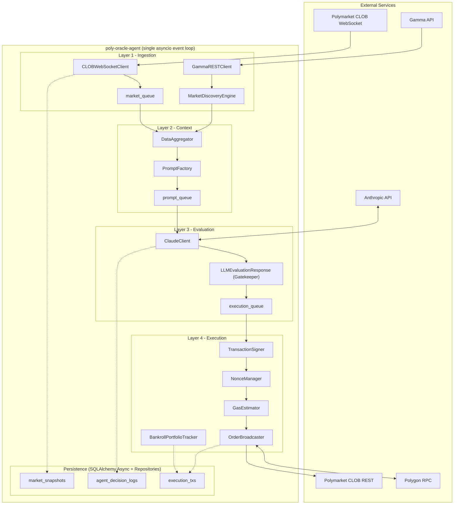

# System Architecture - Poly-Oracle-Agent

**Document Version:** 4.0-draft  
**Aligned With:** `STATE.md` (v0.4.0-draft, 2026-03-26) and `README.md`

## 1. Current Phase Context

The project is in **Phase 4 Planning (Cognitive Architecture)**.

Current runtime remains the proven 4-layer async pipeline from Phase 3 readiness work:
- 92 tests passing
- 90% coverage
- repository-based persistence wiring in place
- strict gatekeeper enforcement in `LLMEvaluationResponse`

Phase 4 introduces planning for cognitive extensions (WI-11/12/13), but these are additive and must not bypass existing risk and execution boundaries.

## 2. Runtime Architecture (Current)



## 3. Runtime Data Flow

1. `CLOBWebSocketClient` ingests and validates market frames.
2. `GammaRESTClient` + `MarketDiscoveryEngine` discover eligible markets and keep selection fresh.
3. `DataAggregator` tracks live state and emits context on time/volatility triggers.
4. `PromptFactory` builds the evaluation prompt payload.
5. `ClaudeClient` requests model output and validates it through `LLMEvaluationResponse`.
6. Gatekeeper-approved decisions route to execution queue only.
7. `TransactionSigner`, `NonceManager`, `GasEstimator`, and `OrderBroadcaster` handle order lifecycle.
8. `dry_run` is enforced before any signed/broadcast side effects.
9. Runtime persistence flows through repository classes only.

## 4. Canonical Class Map

The following class names are the canonical runtime types and must remain unchanged:

| Module | Class |
|---|---|
| `src/agents/ingestion/ws_client.py` | `CLOBWebSocketClient` |
| `src/agents/ingestion/rest_client.py` | `GammaRESTClient` |
| `src/agents/context/aggregator.py` | `DataAggregator` |
| `src/agents/context/prompt_factory.py` | `PromptFactory` |
| `src/agents/evaluation/claude_client.py` | `ClaudeClient` |
| `src/agents/execution/broadcaster.py` | `OrderBroadcaster` |

## 5. Persistence and Session Boundaries

- Runtime agents do not perform ad hoc ORM writes/queries for trading domains.
- Database access is routed through:
  - `MarketRepository`
  - `DecisionRepository`
  - `ExecutionRepository`
- Session lifecycle is async and scoped per operation/task.

## 6. Phase 4 Planned Cognitive Overlay

Planned work items:
- `WI-11` Market Router
- `WI-12` Chained Prompt Factory
- `WI-13` Reflection Auditor

Planned insertion points:
1. **Routing** between aggregation output and prompt strategy selection.
2. **Prompt chaining** as staged extraction -> quantitative reasoning.
3. **Reflection** after draft reasoning and before gatekeeper validation.

All three are constrained to preserve:
- `LLMEvaluationResponse` as final pre-execution gate
- existing Decimal financial integrity rules
- fully async queue-based pipeline behavior

## 7. Source Tree (Relevant Runtime Paths)

```text
src/
├── agents/
│   ├── ingestion/
│   │   ├── ws_client.py
│   │   ├── rest_client.py
│   │   └── market_discovery.py
│   ├── context/
│   │   ├── aggregator.py
│   │   └── prompt_factory.py
│   ├── evaluation/
│   │   └── claude_client.py
│   └── execution/
│       ├── signer.py
│       ├── nonce_manager.py
│       ├── gas_estimator.py
│       ├── broadcaster.py
│       └── bankroll_tracker.py
├── schemas/
│   ├── market.py
│   ├── llm.py
│   └── web3.py
├── db/
│   ├── models.py
│   └── repositories/
└── orchestrator.py
```
