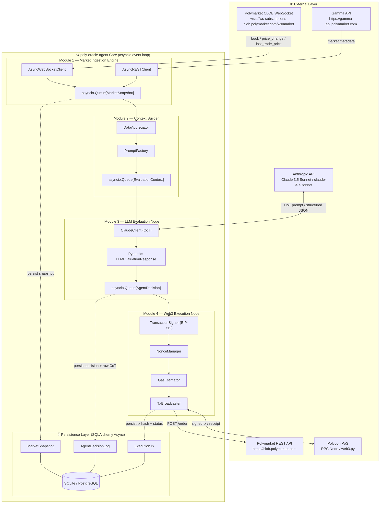
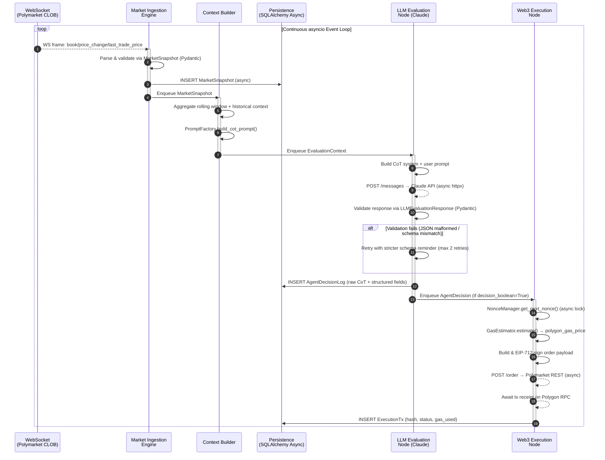

# Arquitectura del Sistema - Poly-Oracle-Agent

**Fase 1: Infraestructura y Modelado de Datos**

El stack está confirmado. Polymarket opera un CLOB (Central Limit Order Book) híbrido *off-chain* con liquidación *on-chain* en Polygon PoS. Se utiliza WebSocket para el streaming del orderbook público en `wss://ws-subscriptions-clob.polymarket.com/ws/market` y REST para la ejecución de órdenes en `https://clob.polymarket.com`.

---

## 1. Diagrama de Arquitectura del Sistema



---

## 2. Diagrama de Secuencia - Bucle de Trading Asíncrono



---

## 3. Árbol de Directorios del Proyecto

```text
poly-oracle-agent/
├── .env                          # ANTHROPIC_API_KEY, POLYGON_RPC, WALLET_KEY, etc.
├── .env.example
├── pyproject.toml                # PEP 621: deps, ruff, mypy, pytest config
├── README.md
│
├── src/
│   ├── __init__.py
│   │
│   ├── core/                     # Shared primitives (no business logic)
│   │   ├── __init__.py
│   │   ├── config.py             # Pydantic-settings: AppConfig (env parsing)
│   │   ├── logging.py            # structlog structured async logger
│   │   └── exceptions.py        # Domain-specific exception hierarchy
│   │
│   ├── db/
│   │   ├── __init__.py
│   │   ├── engine.py             # Async SQLAlchemy engine + session factory
│   │   ├── models.py             # ← MarketSnapshot, AgentDecisionLog, ExecutionTx
│   │   └── repositories/
│   │       ├── __init__.py
│   │       ├── market_repo.py
│   │       ├── decision_repo.py
│   │       └── execution_repo.py
│   │
│   ├── schemas/
│   │   ├── __init__.py
│   │   ├── market.py             # MarketSnapshotSchema, OrderBookSchema
│   │   ├── llm.py                # ← LLMEvaluationResponse (strict Pydantic V2)
│   │   └── web3.py               # OrderPayloadSchema, TxReceiptSchema
│   │
│   ├── agents/
│   │   ├── __init__.py
│   │   ├── ingestion/
│   │   │   ├── __init__.py
│   │   │   ├── ws_client.py      # AsyncWebSocketClient (CLOB stream)
│   │   │   └── rest_client.py    # AsyncRESTClient (Gamma + CLOB REST)
│   │   │
│   │   ├── context/
│   │   │   ├── __init__.py
│   │   │   ├── aggregator.py     # DataAggregator: rolling window logic
│   │   │   └── prompt_factory.py # CoT prompt templating (Jinja2 or f-string)
│   │   │
│   │   ├── evaluation/
│   │   │   ├── __init__.py
│   │   │   └── claude_client.py  # ClaudeClient: async Anthropic call + retry
│   │   │
│   │   └── execution/
│   │       ├── __init__.py
│   │       ├── signer.py         # EIP-712 order signing (web3.py)
│   │       ├── nonce_manager.py  # Async-safe NonceManager (asyncio.Lock)
│   │       ├── gas_estimator.py  # Dynamic gas pricing (Polygon RPC)
│   │       └── broadcaster.py    # TX broadcast + receipt polling
│   │
│   └── orchestrator.py           # Top-level asyncio.gather() wiring all modules
│
├── tests/
│   ├── conftest.py               # pytest-asyncio fixtures, in-memory DB
│   ├── unit/
│   │   ├── test_schemas.py
│   │   ├── test_prompt_factory.py
│   │   └── test_nonce_manager.py
│   └── integration/
│       ├── test_ws_client.py
│       └── test_claude_client.py
│
├── migrations/                   # Alembic async migrations
│   ├── env.py
│   └── versions/
│
└── scripts/
    └── seed_markets.py           # Dev-time market seeding utility
```


## 5. Decisiones Clave de Diseño

| Concern | Decision | Rationale |
| :--- | :--- | :--- |
| Immutability of LLM output | `frozen=True` on `LLMEvaluationResponse` | Prevents accidental mutation in async queues before execution |
| Cross-field validation | `@model_validator(mode="after")` | Enforces EV+/decision coherence at schema boundary, never in business logic |
| 1-to-1 Decision → TX | `unique=True` on `ExecutionTx.decision_id` | DB-level guard against double-execution of a single decision |
| Raw CoT persistence | `reasoning_log: Text` in `AgentDecisionLog` | Full audit trail of every Claude reasoning chain, separate from structured fields |
| Async-safe nonce | `NonceManager` with `asyncio.Lock` (stub) | Prevents nonce collisions under concurrent Polygon tx submissions |
| WebSocket heartbeat | CLOB: ping every 10s, RTDS: every 5s | Per Polymarket connection management requirements |
| Enum sync between layers | `DecisionAction` (ORM) mirrors `RecommendedAction` (Pydantic) | Keeps DB enum and schema enum decoupled |

---

## 6. Próximos Pasos (Fase 2)
*   Implementar `orchestrator.py` para cablear todos los módulos.
*   Implementar `ClaudeClient` con plantillas de prompts CoT.
*   Construir `NonceManager` y `TransactionSigner`.
