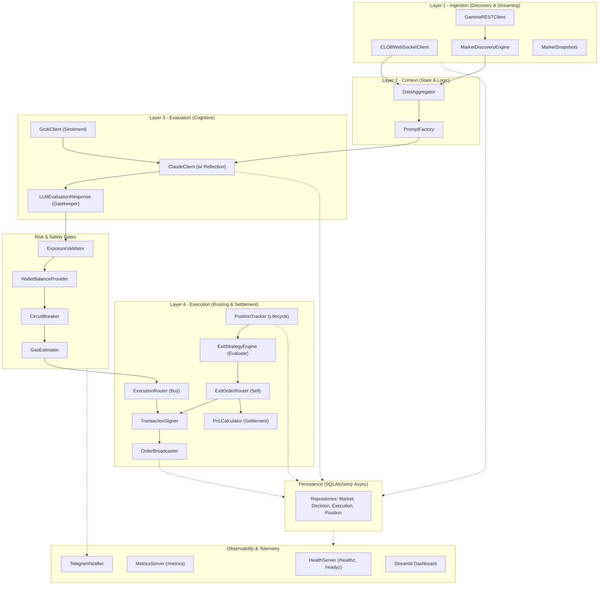

# System Architecture - Poly-Oracle-Agent

**Document Version:** 14.0
**Status:** COMPLETED (Phase 13) / DEPLOYMENT READY (Phase 14)
**Last Updated:** 2026-05-06
**Aligned With:** `STATE.md` (v0.14.0)

## 1. Architectural Philosophy

`poly-oracle-agent` is designed as a **high-integrity, async-first autonomous trading system**. Its architecture prioritizes financial auditability, risk isolation, and deterministic validation over execution speed.

### Core Invariants
1. **Decimal-Only Math:** No floating-point arithmetic is permitted for monetary, pricing, or risk values.
2. **4-Layer Decoupling:** Ingestion, Context, Evaluation, and Execution are isolated via `asyncio.Queue` bridges.
3. **Fail-Closed Safety:** Any missing data, crossed books, or budget exhaustion defaults to a conservative `HOLD` or `SKIP`.
4. **Gatekeeper Authority:** Every trade MUST pass through the `LLMEvaluationResponse` Pydantic validator (the "Gatekeeper").
5. **Repository-Only Persistence:** Direct DB session access is prohibited in agent logic; all I/O is routed through repository classes.

## 2. High-Level Pipeline (The 4-Layer Model)

```mermaid
graph TB
    subgraph L1["Layer 1 - Ingestion (Discovery & Streaming)"]
        direction TB
        WS["CLOBWebSocketClient"]
        REST["GammaRESTClient"]
        MDE["MarketDiscoveryEngine"]
        L1_SNAP["MarketSnapshots"]
    end

    subgraph L2["Layer 2 - Context (State & Logic)"]
        direction TB
        AGG["DataAggregator"]
        PF["PromptFactory"]
    end

    subgraph L3["Layer 3 - Evaluation (Cognitive)"]
        direction TB
        CLAUDE["ClaudeClient (w/ Reflection)"]
        GROK["GrokClient (Sentiment)"]
        GATE["LLMEvaluationResponse (Gatekeeper)"]
    end

    subgraph L4["Layer 4 - Execution (Routing & Settlement)"]
        direction TB
        ER["ExecutionRouter (Buy)"]
        ESE["ExitStrategyEngine (Evaluate)"]
        EOR["ExitOrderRouter (Sell)"]
        PT["PositionTracker (Lifecycle)"]
        PNL["PnLCalculator (Settlement)"]
        SIGN["TransactionSigner"]
        BCAST["OrderBroadcaster"]
    end

    subgraph RISK["Risk & Safety Gates"]
        direction LR
        EV["ExposureValidator"]
        WB["WalletBalanceProvider"]
        CB["CircuitBreaker"]
        GE["GasEstimator"]
    end

    subgraph OBS["Observability & Telemetry"]
        direction TB
        HEALTH["HealthServer (/healthz, /readyz)"]
        METRICS["MetricsServer (/metrics)"]
        TELE["TelegramNotifier"]
        DASH["Streamlit Dashboard"]
    end

    subgraph DB["Persistence (SQLAlchemy Async)"]
        REPOS["Repositories: Market, Decision, Execution, Position"]
    end

    WS --> AGG
    REST --> MDE --> AGG
    AGG --> PF --> CLAUDE
    GROK --> CLAUDE
    CLAUDE --> GATE
    GATE --> EV --> WB --> CB --> GE --> ER
    ER --> SIGN --> BCAST
    PT --> ESE --> EOR --> SIGN
    EOR --> PNL

    L1 -.-> DB
    CLAUDE -.-> DB
    BCAST -.-> DB
    PT -.-> DB

    DB -.-> OBS
    RISK -.-> TELE
```

## 3. Layer Responsibilities

### 3.1 Layer 1: Ingestion
- **CLOBWebSocketClient:** Streams real-time L2 orderbook updates from Polymarket. Hardened with exponential backoff and heartbeat/PONG health tracking.
- **GammaRESTClient:** Queries Polymarket's Gamma API for market metadata, resolution statuses, and volume data.
- **MarketDiscoveryEngine:** Filters and selects eligible markets based on TTR (Time-to-Resolution), volume, and liquidity thresholds.

### 3.2 Layer 2: Context
- **DataAggregator:** Maintains in-memory state of tracked orderbooks. Emits `MarketSnapshot` updates on time-based or price-volatility triggers.
- **PromptFactory:** Assembles high-fidelity LLM prompts by combining market data, technical indicators, and historical context.

### 3.3 Layer 3: Evaluation
- **ClaudeClient:** The single canonical evaluation client for both Anthropic Claude and DeepSeek V4 Pro (WI-54). Provider selection is operator-configurable via `LLM_PROVIDER`. Both providers are accessed through the existing `anthropic` SDK; no other LLM SDK is introduced. Includes a mandatory **Reflection Auditor** pass to detect bias or reasoning contradictions. `LLMEvaluationResponse` remains the terminal Gatekeeper regardless of provider.
- **GrokClient:** Fetches real-time sentiment signals from xAI/Grok (crypto/politics categories) to supplement evaluation.
- **LLMEvaluationResponse (Gatekeeper):** A rigid Pydantic V2 schema that enforces the 5 mandatory safety filters (EV, Confidence, Spread, Exposure, TTR).

### 3.4 Layer 4: Execution
- **ExecutionRouter:** Handles BUY routing, Kelly-fraction position sizing, and slippage protection.
- **ExitStrategyEngine:** Periodically scans open positions for exit signals (Take Profit, Stop Loss, Trailing Stop, or Time Exit).
- **ExitOrderRouter:** Routes SELL orders for actionable exits, ensuring fresh orderbook liquidity before submission.
- **PnLCalculator:** Computes gross and net realized PnL (including gas/fees) and handles position settlement.
- **PositionTracker:** Maintains the lifecycle of every trade from `OPEN` to `CLOSED` or `FAILED`.

## 4. Risk & Safety Infrastructure

- **Circuit Breaker:** An in-memory state machine that trips on `CRITICAL` drawdown alerts, blocking new BUY entries while allowing SELL exits.
- **Exposure Validator:** Enforces portfolio-level and category-level exposure caps by querying `PositionRepository`.
- **Wallet Balance Provider:** Verifies MATIC (gas) and USDC (capital) balances via Polygon RPC before evaluation.
- **Transaction Signer:** Canonical EIP-712 signer with strict `dry_run` isolation.
- **Order Broadcaster:** Submits signed orders to the Polymarket CLOB.

## 5. Observability & Operations

- **HealthServer:** Exposes `/healthz` (liveness) and `/readyz` (readiness based on WS/DB/RPC health).
- **MetricsServer:** Exposes `/metrics` in Prometheus format with low-cardinality operational telemetry.
- **TelegramNotifier:** Routes alerts (Circuit Breaker, Drawdown, Restarts) and trade summaries to the operator.
- **Command Center:** A read-only Streamlit dashboard for real-time monitoring of PnL, decisions, and market state.

## 6. Backtesting & Validation

- **BacktestDataLoader:** Replays historical CLOB snapshots in strict chronological order.
- **BacktestRunner:** Executes the full pipeline (Layers 2-4) in a hard-coded `dry_run=True` environment.
- **Historical Pipeline:** Scripts for building lookahead-safe datasets from resolved market history.
- **Validation Report:** Produces a `LiveReadinessVerdict` based on calibration, PnL, and drawdown metrics.

## 7. Deployment Model

- **Docker Compose:** Multi-service topology (orchestrator, dashboard, backtester).
- **DigitalOcean:** Single-node Droplet deployment with non-root runtime, UFW hardening, and persistent volume mounting for SQLite.
- **Persistence:** SQLite (`aiosqlite`) for audit logs and position tracking; Alembic for schema migrations.

## 8. Source Tree Mapping

| Path | Responsibility |
|---|---|
| `src/agents/ingestion/` | Layer 1 (WS, REST, Discovery) |
| `src/agents/context/` | Layer 2 (Aggregator, Prompt Factory) |
| `src/agents/evaluation/` | Layer 3 (Claude, Grok, Reflection) |
| `src/agents/execution/` | Layer 4 (Router, Exit, PnL, Signer, Broadcaster) |
| `src/db/repositories/` | Data Access Layer (Repository Pattern) |
| `src/observability/` | Health, Metrics, Alerts |
| `src/ui/` | Streamlit Dashboard |
| `src/schemas/` | Typed Contracts (Market, LLM, Risk, Execution, Position) |
| `src/orchestrator.py` | Main Event Loop & Lifecycle Management |
